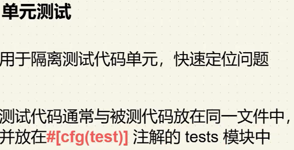
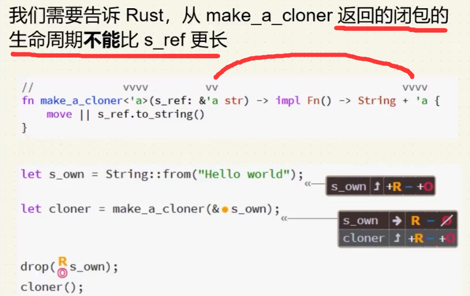
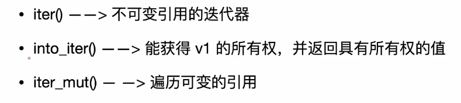

# 基本语法

## 函数调用方式（命名空间or引用）

```rust
//< 显示(解)引用使用 命名空间::
//< 隐式(解)引用使用 变量.
fn ref_core() {
    let x: Box<i32> = Box::new(1);
    let r: &Box<i32> = &x;
    let r_abs1 = i32::abs(**r); 
    let r_abs2 = r.abs();
    assert_eq!(r_abs1, r_abs2);

    let s = String::from("");
    let s_str1 = str::len(&s);
    let s_str2 = s.len();
    assert_eq!(s_str1, s_str2);
}
```


## 语句表达式

```rust
//< 表达式和语句
//< 语句可以返回值，且可以作为一个方法最后一个语句返回
//< let x = 1; 是表达式 | x+1 是语句
fn integer2() -> i32 { let x = 1; x + 1 }
```

## loop循环/标签

```rust
fn loop_core() {
    let mut count : i32 = 0;
    'breaking : loop {
        let mut flag : i32 = 3;
        loop {
            if flag == 1 {
                break;
            }
            if count == 1 {
                break 'breaking; // 语法糖，使用标签跳出外层循环
            }
            flag -= 1;
        }
        count += 1;
    }
    println!("count {count}");
}
```

## 切片

```rust
fn for_core() {
    let _arr = [10, 20 ,30];
     for val in _arr {
        println!("{val}");
    }
    //< 使用range 遍历集合的[0, 1]元素，=号是为了包含，可以不写或者写<，使用内置的rev（C++reverse）逆向遍历
    for val in (0..=1) .rev() {
        println!("{val}");
    }

}
```

## 斐波那契

```rust
fn fib(n : usize) -> usize {
    if n <= 2 { return n; }
    let mut prev1: usize = 1;
    let mut prev2: usize = 2;
    let mut current: usize = 0;
    let mut i: usize = 3;
    while i <= n {
        current = prev1 + prev2;
        prev1 = prev2;
        prev2 = current;
        i += 1;
    }
    return  prev2;
}
```


# 权限

变量的权限类型

**读R**：数据可以被复制到另一个位置

**写W**：数据可以被修改

**拥有O**：数据可以被移动或者释放

这些权限在运行时并不存在，尽在编译器内部存在

默认情况下，变量对数据具有R/O权限，如果加上关键字mut则还能够拥有W权限

**引用可以临时移除这些权限**

* 权限是定义在位置上的（不仅仅是变量）。
* 位置是任何可以放在赋值语句左侧的东西。
* 位置包括：
  * 变量，如 a
  * 位置的解引用，如*a
  * 位置的数组访问，如 a[0]
  * 位置的字段访问，如a.0（元组），a.x（结构体）
  * 上述的任何组合

**借用规则：**

* **在任何时刻，要么拥有一个<u>*可变引用*</u>，要么任意数量的不可变引用**
* 引用必须始终有效

```rust
let mut v: Vec<i32> = vec![1,2,3];	// v有R/W/O
let num: &i32 = &v[2];				// 执行完成这一行代码，v有R、num有R/O（权限O可以移动释放v[2]而不是v）、*num有R

//< 情况一，OK
println!("{*num}");					// 执行完成这一行代码，v有R/W/O、num和*num无任何权限
v.push(4);							// v无任何权限

//< 情况二，ERROR
v.push(4);							// v有R权限，错误他没有写权限但是尝试push
println!("{*num}");					
```

可变引用

```rust
let mut v: Vec<i32> = vec![1,2,3];	// v有R/W/O
let num: &mut i32 = &mut v[2];				// 执行完成这一行代码，v无任何权限、num有R/O、*num有R/W权限

我的理解，v[2]是数字，加上&，不能修改，再加上mut，可以通过指针修改，赋值一个可以修改值的指针给num，num有R/O权限操作这个指针，因为不是mut所以不能修改这个指针，O的权限是最终这个数据的最后一个对象持有

*num +=1;
let num2: & i32 = & *num; // 解引用获取 “可以修改值的指针”，在加上&使其降级为“只读指针”

println!("{*num}");	//执行完num、*num无任何权限，v有R/W/O
println!("{v}");	//执行完v无任何权限
```

流动权限F：在表达式使用输入引用或返回输出引用时需要

F权限在函数体内不会发生变化

如果一个引用被允许在特定的表达式中使用（流动），那么它就具有F权限

```rust
fn first_or(strings: &Vec<String>, default: &String) -> &String{
	if strings.len() > 0 { &strings[0] } else { default }//编译器报错，F权限仅在strings.len() 拥有，因为编译器不知道你返回的是哪一个引用
}

如果使用的时候你返回的是 &strings[0]，在外部使用的时候你却drop(default)，是非常危险的未定义行为

fn return_a_string() -> &String{
	let s = String::from("");
    let s_ref = &s;
    s_ref //s_ref没有F权限，本质上他是引用s，方法结束后s就被释放了，悬挂指针
}

解决方案一,所有权转移move
fn return_a_string() -> String{
	let s = String::from("");
    s
}
解决方案二，静态？
fn return_a_string() -> &'static str{
	""
}
解决方案三，Rc引用计数，shared_ptr
use std::rc::Rc;
fn return_a_string() -> RC<String>{
	let s = Rc::new(String::from(""));
    Rc::clone(&c)
}
解决方案四，参数引用
use std::rc::Rc;
fn return_a_string(output: &mut String){
    output.replace_range(.., "");//将字符串全部替换
}
```


```rust
//解决
let v: Vec<String> = vec![String::from("")];
let s: String = v[0].clone();
```


```rust
fn main() {
	let mut name = (String:;from("1"), String::from("2"));
	//let first = &name.0;  //ok，仅0失去mut权限
	let first = get_first(&name);//error, 本质一样，但是rust只看函数签名不了解内部情况，所以rust不知道参数的两个引用方法get_first返回的是&name.0还是&name.1，所以不知道是让哪一个元素赋值的first变量失去了mut权限
	name.1.push_str("");
	println!("{first}{name.1}");
}
fn get_first(name : &(String, String)) -> &String{
	&name.0
}
```


```rust
fn main() {
	let mut a = [0,1,2,3];
	let x = &mut a[1]; // x有R/W/O权限，a失去所有权限？还是有只读权限
	*x += 1;
	
	let y = &a[2]; // 错误,y不能获得O权限
	*x += *y;		//因为x还需要使用，O权限持有
	println!({a:?});
}
```


# 结构体

## Derived Trait

```rust
#[derive(Debug, Copy, Clone)]
struct Rect {
	width: u32,
    height: u32, // , 结尾
} //不需要加;

// 结构体的方法实现必须定义在外部，且加上impl，Rust摒弃了继承改用组合
impl Rect {
    // 方法的第一个参数必须是self，可不是&，类似C++的隐藏this指针
    fn area(&self) -> u32 {
        self.width * self.height
    }
    fn equal(&self, other: &Rect) -> bool {
        self.width == other.wdith && self.height == other.height
    }
    fn setWidth(&mut self, width: u32) {
        self.width = width;
    }
    /*
    如果使用这个max方法，那么外部的Rect对象所有权全部丢失
    */
    fn max(self, other: &Rect) -> Self {
    	let w = self.width.max(other);
        let h = self.height.max(other);
        Rect {
            width: w,
    		height: h
        }
    }
    
    fn setToMax(&mut self, other: &Rect) {
    	*self = self.max(other); // 错误，setToMax的self的所有权 被 max的self获取了, 解决，derive中加上Copy,Clone，max的传参self就相当于拷贝了数据
    }
    
    // 关联函数，可以没有第一个参数self，Self就是结构体的别名
    fn square(size: u32) -> Rect/*or Self*/ {
        Self {
            width: size,
    		height: size,
        }
    }
    
}

fn main() {
	let rect = Rect {
        height: 50,
        width: 30, //不需要考虑定义顺序
    };
    println!("{:?}", rect);	// 等价于println!("{rect:?}") 
    //方式一：为了打印Rect结构体，需要加 :? 并在Rect上加上#[derive(Debug)]，{}内部也可以写:#?，这样更清晰，类似Json的详细和缩略格式布局，
    //方式二：实现std::fmt::Dispaly
    let oehtrRect = Rect {
        height: 50,
        width: 50, //不需要考虑定义顺序
    };
    let maxRect = rect.max(oehtrRect);
    println!("{}", rect.area); // 错误rect 独享失去所有权限
}
```

# 枚举

```rust
fn main() {
    // 一般用法和C++一样
    
    // 特殊用法，枚举可以存值，值类型可以不同，类似std::pair
	enum IpAddrKind {
		V4(u8,u8,u8,u8),
		V6(String),
        VV
	}
    //枚举也可以实现方法
    impl IpAddrKind {
		fn XX(&self) {}
    }
    let home = IpAddrKind::V4(127,0,0,1);
    let loopback = IpAddrKind::V6(String::from("::1"));
}
// 特殊枚举，表示有/无，std::optional?，常用于判断对象是否为空，Rust没有null
enum Option<T> {
	None,
    Some<T>
}

fn main() {
	let x = 5;
    let y: Option<i8> = Some(5);
    let sum = x + y; // +错误，必须处理选项
    // 正确写法 
    // 一
    let sum = x + y.unwrap_or(0); // 当y为None时，默认用0替代
    // 二
    let sum = match y {
        Some(val) => x + val,
        None => x, // 或自定义处理逻辑，例如返回x本身
    };
    // 三
    let sum = if let Some(val) = y {
        x + val
    } else {
        x // 或其他默认值
    };
    println!("Sum = {}", sum); // 输出: Sum = 10
}
```

## Match（swich）/ if let

```rust
enum MonthDay {
	ThreeOne,
    Three,
}

enum Time {
	Year,
	Month(MonthDay),
	Day,
	Hour,
}

// 类似C#的swich语法糖,	match 的分支必须穷举情况
fn match_time(time: Time) -> u8{
	match time {
        Time::Year => 1,
        Time::Month(MonthDay) => 2,
        Time::Day => {
            println!("Have a good day");
            3
        },
        _ => 4,
	}
    if let Time::Year = time {
        println!("let time to Time::Year");
    };
}

let opt : Option<Stirng> = Some(String::from(""));

match opt {
    Some(_) => println!(""),
    None => println!(""),
}
println!("{:?}", opt); //ok ，因为match没有Some使用值

match /*&*/opt { 
    Some(s) => println!("{s}"),
    None => println!(""),
}
println!("{:?}", opt); //error ，opt部分值发生了移动，丧失了权限,	加引用修复


// if let 只匹配一种模式，也就是说除了指定需要的match 枚举，其他的是_，可以使用这个语法糖简化
fn match_time(time: &Time) {
	if let Time::Year = time {
        println!("let time to Time::Year");
    }
    /*else{}*/
    ;
}
```

# 模块

模块module，将代码组织成更小、更易于管理的单元方法，关键字mod

##  mod 定义的三种方式

1. 当前rs文件下定义

```rust
fn main() {}

mod models/*随便起一个模块名字，类似命名空间*/ {}
```

2. src/下新建rs文件定义

```rust
创建 src/模块文件，如math.rs

那么src 下的所有rs文件都能够使用
示例：
src
-math.rs
-main.rs 使用 mod math
/*使用类似python的包？*/
```

3.src/下新疆文件夹，文件夹

```rust
必须定义mod.rs文件进行识别，类似python的__init__文件？

src
-math.rs
-main.rs 使用 mod math，可以使用mod glm 模块
--glm
--mod.rs /*必须定义*/可以使用mod math 模块
```

## 全部导出

```
pub use self::命名空间::结构体/枚举::方法
```


## 顶级模块crate

只要你定义了模块，可以使用crate进行指定

```rust
crate::glm接glm子模块接方法
crate::math接math子模块接方法
示例
math.rs文件
    pub mod cal{
        pub fn rect_area(w :&u32, h: &u32) -> u32 {
            w * h
        }

    }
main.rs文件
mod math; //引入
fn main() {
    let w:u32 = 10;
    let h:u32 = 10;
    let result = crate::math::cal::rect_area(&w, &h);
}

或者在main.rs文件中定义
mod math {
    pub mod cal{
        pub fn rect_area(w :&u32, h: &u32) -> u32 {
            w * h
        }

    }
}


或者这样写
src
-glm
--mod.rs
--math.rs
-main.rs
//math.rs文件
	fn test() {
		self::constval::get_pi();
	}
    pub mod cal{
        pub fn rect_area(w :&u32, h: &u32) -> u32 {
            w * h
        }
		pub fn circle_area(r :& f64) ->f64 {
			r * r * super::constval::get_pi() // 回退上级模块
		}
    }
    pub mod constval{
    	pub fn get_pi() -> f64 {
    		3.1415926
    	}
    }

//mod.rs文件
pub mod math;

//main.rs文件
mod glm;
fn main() {
    fib(10);
    let w:u32 = 10;
    let h:u32 = 10;
    let result = crate::glm::math::cal::rect_area(&w, &h);
    //() //main 方法隐含了一个语句
}

简化写法
mod glm;
use crate::glm::math::cal;// 类似c++/C#的命名空间导入using
fn main() {
    fib(10);
    let w:u32 = 10;
    let h:u32 = 10;
    let result = cal::rect_area(&w, &h);
    //() //main 方法隐含了一个语句
}
```

可以使用super::回退当前模块得到上级模块，或者使用self::当前模块下查找其他模块

```
mod math {
	fn test() {
		self::constval::get_pi();
	}
    pub mod cal{
        pub fn rect_area(w :&u32, h: &u32) -> u32 {
            w * h
        }
		pub fn circle_area(r :& f64) ->f64 {
			r * r * super::constval::get_pi() // 回退上级模块
		}
    }
    pub mod constval{
    	pub fn get_pi() -> f64 {
    		3.1415926
    	}
    }
}
```

## 可见性


## use


as关键字起别名

```rust
use std::fmt::Result
use std::io::Result as IoResult
```


多个模块的库可以使用类似vue模块导入写法

```rust
use csv::{Writer, ReaderBUlider};//指定使用部分模块
use csv::*;//使用全部模块
```


## 三方库使用

（1）在toml文件的dependencies 中手动添加

```toml
[package]
name = "rustlearn"
version = "0.1.0"
edition = "2024"

[dependencies]
csv = "1.3.0"
```

（2）cmd命令行添加

```
cargo add serde （一个序列号反序列化的库）完成之后会在toml自动写入库名字和版本
```

# Vec

```rust
//获取值
fn main() {
    let v = vec![1,2,3];
	let third: &i32 = &v[2];
	
	let third: Option<&i32> = v.get(2);
	if let None = third { println!("out of range") }
}


```

```rust
//遍历
fn main() {    
    let mut v = Vec::new();
    let s = String::from("s");
    v.push(s);
    for index in (0..v.len()) {
        v.get(index);
    }
    for val in /*&mut*/v {
        let x = val;
    }
    for val: &String in v.iter()/*等价&v*/ {
        let x: &String = val;
    }
    for val: &String in v.iter() {
        let x: String = (*val).clone(); // 简写val.clone()
    }
    //() //main 方法隐含了一个语句
}
```

# String

内部逻辑是Vec<u8>实现的包装

```rust
fn main () {
    let mut s = String::new();
    let data: &str data = "xx";
    let s: String = data.to_string(); // 实现了Trait（接口）的结构体能够使用这个方法将&str转换为String
    let s = String::from("");
    
    let s1 = String::from("");
    let s2 = String::from("");
    let s3 = s1 + &s2; //执行完之后 s1 被移动 不能再使用，而s2是引用可以使用
    // 内部逻辑是获得s1的所有权，让后将s2拷贝一份加到s1的后边，如果s1的cap足够大，那么s1不会内存分配，否则内存分配（c++的vector动态扩容机制），然后将s1的所有权移动给s3
    
    let s = format!("{s1}-{s2}-{s3}");//较于 + 拼接，这种方式更常用
}
```

## 遍历

```rust
//< 和C++不同，索引访问不被允许，原因是应为u8编码占字节不同原因
let s = "我们的";
let i = &s[0]; // 错误

//< 切片遍历
let s1 = &s[0..9]; //  ok，输出“我们的“，中文一个字占3个字节
let s2 = &s[0..2]; // 错误，不能将其拆分
let s2 = &s[0..=2]; // ok，输出我“

//< 标准库提供遍历

for c in s.chars() {
    println!("{c}"); // 字符
}

for b in s.bytes() {
    println!("{b}"); // 十进制编码 230 136 145 代表我
}
```


# HashMap

默认使用SipHash进行hash操作，相对安全，但是比较C++的来说不够快，可以通过指定的hasher（实现BulidHasher这个Trait）来切换自定义的hash函数

```rust
use std::collections::HashMap;
fn main() {    
    use std::collections::HashMap;

    let mut dict = HashMap::new();
	dict.insert(String::from("A"), 10);
	dict.insert(String::from("A"), 20); //覆盖10
    let val: &mut i32 = dict.entry(String::from("A")).or_insert(30);//如果不存在插入30，存在则返回存在的值的引用
    println!("{dict:?}");
    
    let text:&str = "hello world A world";
    for word in text.split_whitespace() {
        let count = map.entry(word).or_insert(0);
        *count += 1;
    }
}
```

# 处理错误的机制

rust没有exception

## panic!()


panic!后的响应模式

1. 展开Stack并清理数据（默认）

2. 立即终止(abort)

   * 使用abort

   ```toml
   Cargo.toml
   
   [package]
   
   [dependencies]
   #添加以下代码
   [profile.release]
   panic = "abort"
   ```


栈追踪 backtrace （必须在Debug模式）

使用

项目目录下

```
cargo run
SET RUST_BACKTRACE = 1 /*更详细的话写full*/
cargo run
```

## enum Result<T,E>

```
enum Result<T,E> {
	Ok(T), // 成功返回句柄
	Err(E), // 包含错误信息
}

use std::fs::File;
fn main() {
	let file = File::open("test.txt");
	println!("{file:?}"); 
	// 如果不存在，输出Err(0s {code: 2, kind: NotFound, message: "The system cannot find the file specified."})
    // 如果存在，输出Ok(File {handle: 0xac, path: "\\\?\\test.txt的绝对路径")
    
     //具体操作
    let file = match File::open("test.txt") {
    	Ok(file) => file,
    	Err(error) => panic!("open failed {error:?}")
    };
    // 更详细的错误处理
    let file = match File::open("test.txt") {
    	Ok(file) => file,
    	Err(error) => match error.kind() {
    		ErrorKind::NotFound => match File::create("test.txt") {
    			Ok(fc) => fc,
    			Err(e) => panic!("create failed {e:?}")
    		},
    		other_err => panic!("unknown failed {other_err:?}")
    	}
    };
}
```

## panic和Result使用情况


## unwrap/expect


## 错误传递


## ? operator简化match/ if let


```rust
fn last_char_of_first_line(text: &str) -> Option<char> {
	text.lines().next()?.chars().last() //next错误直接返回，否则继续执行链式调用
}

fn main() /*-> Result<(), Box<dyn Error>>*/ {
	let file = File::open("test.txt")?; //错误，main的返回类型是 (), 去掉注释就正确
	
	/*Ok(())*/
}
```

如果操作成功，它会解包Ok并继续执行下一行代码

如果操作失败，它会立即返回Err，并将错误传播给调用者

以下三种代码写法等价


## 自定义错误处理


```rust
use std::io::{Error, Read};
use std::io;
use std::fs::File;
use std::num::PaserIntError;

#[derive(Debug)]
pub enum MyError {
	IO(io::Error)
    PARSEINT(PaserIntError)
    OTHER(String)
}

impl From<io::Error> for MyError {
    fn from(value: Error) -> Self {
        MyError::IO(value)
    }
}

impl From<PaserIntError> for MyError {
    fn from(value: PaserIntError) -> Self {
        MyError::PARSEINT(value)
    }
}


fn read_username_from_file() -> Result<String, MyError> {
    let mut name = String::new();
    let file = File::open("text.txt")?.read_to_string(&mut name)?;
	let num: i32 = "55".parse()?;
    Ok(name)
}
```

# 泛型

```rust
// 需要假设T类型是能够通过 > 进行比较的类型
fn largest<T>(list: &[T]) ->&T {
    let mut largest = &list[0];
    for item in list {
        if item > largest { largest = item }; // 这里会报错，之后需要进行约束
    }
    largest
}

// 模板类
struct Point<T> {
    x: T,
    y: T
}

impl<T> Point<T> {
    fn x(&self) -> &T {
        self.x
    }
}

//特化
impl Point<f32> {
    fn distance_from_origin(&self) -> f32 {
        (self.x.powi(2) + self.y.powi(2)).sqrt()
    }
}
```

# Trait

## 使用示例

一个Trait定义了特定类型的所有功能

可以使用Trait以一种抽象的方式来定义共享的行为

可以使用Trait Bounds 来指定哪些类型才是我们想要的泛型类型

```rust
// 类似java接口, RUST没有继承，所以没有C++虚函数作为接口概念
pub trait Summary {
	fn summarize(&self) -> String; // 可以有默认实现写法
    /*
    fn summarize(&self) -> String {
        String::from("Default")
    }
    */
}

pub struct NewsArticle {
	pub headline: String,
	pub location: String,
	pub author: String,
	pub content: String,
}

pub struct Tweet {
	pub username: String,
	pub content: String,
	pub reply: bool,
	pub retweet: bool,
}

impl Summary for NewsArticle {
    fn summarize(&self) -> String {
        format!("{}, by {} ({})", self.headline, self,author, self,location)
    }
}

impl Summary for Tweet {
    fn summarize(&self) -> String {
        format!("{}: {} ({})", self.username, self,content)
    }
}

/*
// 传入trait作为参数，类似java的通过接口组合模式，来实现不同的具体类型的同一行为（Animal 叫， dog 叫， 猫叫）
pub fn notify(item: &impl Summary) {
	println!("")
}
*/
```

## Trait的实现规则


## trait bound 约束

类似C++20 的concept，trait bound需要指定在方法后面<>进行括起来，或者参数使用impl约束

```rust
// 写法一
pub fn notify<T: Summary>(item: &T) { // 约束T类型必须是实现了Summary
	
}
// 写法二
pub fn notify(item1: &impl Summary, item2: &impl Summary) {
    
}

// 多个trait bound 的指定
// 写法一
pub fn notify<T: Summary + Display>(item: &T) { // 约束T类型必须是实现了Summary
	
}
// 写法二
pub fn notify(item: &(impl Summary + Display)) {
    
}

where 简化签名
fn some_func<T, U>(t: &T, u: &U) -> i32 
	where
		T:Summary + Display,
		U:Clone + Debug,
{
    
}
```

# 生命周期

目的是防止悬挂指针，Rust值悬垂引用，和C++一样出了花括号就被释放，RAII思想


## 生命周期注解

生命周期注解**不会改变引用存活的时间**

而是**描述多个引用之间的生命周期关系**


语法：

生命周期参数：

必须以 ' 开头，通常是小写，并且非常短，位置紧跟在引用&后，用空格和类型分开

```rust
&i32
&'a i32
&'a mut i32
```

函数生命周期注释

```rust
// 如果不写生命周期注解，那么以下方法会报错，因为编译器不知道返回的是x引用还是y引用
// 'a 代表 x 和 y 中 生命周期 较短 的那一个
fn longest<'a>(x: &'a str, y: &'a str2) -> &'a str {
	if x.len() > y.len() {x} else {y}
}

fn main() {
    // ok
    let string1 = String::from(" string1 longest");
    {
        let string2 = String::from("string2");
        let result = longest(string1.as_str(), string2.as_str());
        println("Longest is {result}");
    }
    
    // error, result生命周期取决于 string1 和 string2 中最短的那一个，这里string2最短，只能够在string2的生命周期内使用result，如果超出就报错
    let string1 = String::from(" string1 longest");
    let result;
    {
        let string2 = String::from("string2");
        result = longest(string1.as_str(), string2.as_str());
    }
    println("Longest is {result}");
}
```

结构体生命周期注解

如果结构体成员变量定义了生命周期注解，那么这个结构体对象的生命周期将取决与最短的那一个变量生命周期

```rust
struct ImportantExcerpt<'a>{
	part: &'a str,
}

fn main() {
	let novel = String::from("call me x. some.");
	let first_sentence = novel.split('.').next().unwrap();
	let i = ImportantExcerpt{
		part: first_sentence,
	}; //i的生命周期取决于 ，part的生命周期
}
```

## 三条规则


```rust
三条规则使用
//<规则一
// 编译器自动推断 ok
fn first_word(s: &str) -> &str
//< 规则二 ok
fn first_word<'a>(s: &'a str) -> &str
fn first_word<'a>(s: &'a str) -> &'a str

// error 推断不出
fn first_word(x: &str, y: &str) -> &str
fn first_word<'a, 'b>(x: &'a str, y: &'b str) -> &/*?*/ str

//< 规则三
impl<'a> ImportantExcerpt<'a> {
    fn announce_and_return_part(&self. anno: &str) -> &str { // 返回的&str生命正确是&self的生命周期，即ImportantExcerpt对象的生命周期
        println!("{anno}");
        self.part
	}
}
```


```rust
struct Foo<'a> {
    bar: &'a i32
}
fn baz(f:&Foo) ->&i32 { //错误，Foo的生命周期取决于bar，而参数却传入&
    f.bar
}
fn baz(f:Foo) ->&i32 { //ok
    f.bar
}
```


## 静态生命周期

生命周期跟随程序

写法 'static

注意：Rust中**所有字符串字面量**，都具有'static 生命周期

```rust
let s: &'static str = "II";
```

## 综合

```rust
use std::fmt::Display;

fn longest_with_an_announcement<'a, T>(
	x: &'a str,
	y: &'a str,
	anno: T, // 可以有,
) -> &'a str
where
	T: Display, // 可以有,
{
	println!("{anno}");
	if x.len() > y.len() {x} else {y}
}
```

# 编写测试

类似java注解测试，控制台输出类似c++/gtest

注解

模块的#[cfg(test)]

方法的 #[test]

执行

**cargo test**

```rust
pub fn add(left:u64, right:u64) -> u64 {left+right}

pub struct Guess {
    value: i32,
}

impl Fyess {
    pub fn new(value: i32) -> Guess {
        if value < 1 {
			panic!("Guess value must be greater or equal to 1, got {value}.");
        }
        else if value > 100 {
			panic!("Guess value must be less than or equal to 100, got {value}.");
        }
        Guess{value}
    }
}
#[cfg(test)]
mod test{
	use super::*;
	#[test]
	fn it_works() {
		let result = add(2,2);
		assert_eq!(result, 4);
	}
    
    #[test] // 处理Err可以这样写，但是返回了Result就不能使用#[should_panic]
	fn it_works() -> Result<(), String> {
		let result = add(2,2);
		if result == 4 { Ok(()) } else { Err(String::from("add value not equal 4")) }
	}
    
    #[test]
    #[should_panic] // 边界测试，发生panic就是true通过，负责测试是failed
    //#[should_panic(expected = "less than or equal to 100")] // 只有大于100捕获输出，测试返回success，否则failed
    fn greater_than_100(){
        Guess::new(200); 
    }
}
```

# 执行与组织测试

测试的默认运行模式是**并行模式**

所以必须确保：

1. 各个测试不互相依赖

2. 不依赖于共享的状态（包括环境：目录、环境变量等

单线程测试 `cargo test -- --test-threads=1`


测试默认是看不到代码中print的内容

要想显示 `cargo test -- --show-output`


指定跑某个测试方法

`cargo test 测试方法的名字（比如 add）`

指定跑某些具有部分相同名字的测试方法

`cargo test 测试方法的名字（比如 add_point, add_rect 那么我们输入add即可）`


使用#[ignore]可以不跑所有被忽略的测试

```
#[test]
#[ignore]
fn add() {}
```

进行跑所有被忽略的测试

`cargo test -- --ignored`

跑所有的测试

`cargo test -- --include-ignored`


跑集成测试

`cargo test --集成测试的文件名称`


跑某一个package 的测试

`cargo test -p package的名字`





如果有辅助的文件给集成测试文件使用，一、将common.rs和集成测试的rs文件同级，但是这样cargo测试之后会输出common的测试这样不够清晰，二、为此我们可以新建一个common文件夹再建一个mod.rs文件内防止测试辅助函数，这样测试就不会输出这个辅助函数的测试模块


# 闭包

可以存储在变量中或作为参数传递给其他的匿名函数（lambda）

## 代码示例

```rust
#[derive(Debug, PartialEq, Copy, Clone)]
enum ShirtColor {
    Red,
    Blue,
}

// 仓库
struct Inventory {
    shirts: Vec<ShirtColor>, //衬衫
}

impl Inventory {
    fn giveaway(&self, user_preference: Option<ShirtColor>) -> ShirtColor {
        // else的时候 闭包  []() { this->most_stocked(); }
        user_preference.unwrap_or_else(|| self.most_stocked())
    }

    fn most_stocked(&self) -> ShirtColor {
        let mut num_red = 0;
        let mut num_blue = 0;

        for color in &self.shirts {
            match color {
                ShirtColor::Red => num_red += 1,
                ShirtColor::Blue => num_red += 1,
            }
        }
        if num_red > num_blue { ShirtColor::Red } else { ShirtColor::Blue }
    }
}


fn main() {
    let store = Inventory {
        shirts: vec![ShirtColor::Red, ShirtColor::Blue, ShirtColor::Red],
    };

    let user_pref1 = Some(ShirtColor::Red);
    let giveaway1 = store.giveaway(user_pref1);
    println!(
        "the user with preference {:?} gets {:?}",
        user_pref1, giveaway1
    );

    let user_pref2 = None;
    let giveaway2 = store.giveaway(user_pref2);
    println!(
        "the user with preference {:?} gets {:?}",
        user_pref2, giveaway2
    );
}
```

### 注意事项

```rust
fn main() {
    let mut s = String::from("123");
    let add_s = |s: &mut String| s.push_str("123");
    println!("{s}"); // ok
    add_s(&mut s);
    
    let mut s = String::from("123");
    let add_s = || s.push_str("123");
    println!("{s}"); //error
    add_s();
    
    let mut num = 1;
    let mut expensive = |x: u32| -> u32 {
        println!("{num}|{x}");
        num = 3;
        num + x
    };
    println!("{num}"); // 错误， num的拥有权在 expensive，只有用完之后才可以使用
    println!("{}", expensive(1));
    let x = num;
    println!("{x}");
    // 输出
    //  1|1
	//	4
	//	3
    //  说明是可变引用捕获 num， 如果num 不是mut 那么就是不可变引用
    
    let list = vec![1,2];
    println!("list:?}");
    thread::spawn(move || println!("{list:?"}")) // 使用move完全将所有权 移动 到线程内部
        .join()
        .unwrap();
    // 之后不能再使用list
    
    
    let example = |x| {x}; //不声明 类型和返回类型 交给编译器推断
    let s = example(String::from("")); // 编译器第一次找到将examle实例化为了String类型
    let n = example(1); // 错误，不在能够推导出 i32 类型，因为 let s先于let n 被实例化确定了类型
    
    let f = |_| (); // 厕所闭包
    let s = String::from("");
    f(s);
    println!("{s}"); // 错误， s 已经被移动到了 _ 
}
```

## Fn Traits

闭包体可以对捕获的值进行操作

* 将捕获的值移出闭包
* 修改捕获的值
* 既不也移动不修改值
* 完全不从环境中捕获值

FnOnce—>FnMut—>Fn ，继承关系，实现了Fn就相当实现了前两个

### FnOnce


### FnMut


### Fn


### unwrap_or_else（FnOnce）


### sort_by_key（FnMut）

需要多次调用修改list


## 闭包生命周期

### 问题


### 解决



```rust
fn make_a cloner(s_ref: &str) -> impl Fn() -> String + '_ { // 根据生命周期签名规则可以省略部分内容，但是返回的不能省略
	move || s_ref.to_string()
}
```


## 理解

```
|| 这个类比为C++ lambda的 () 用于传参数

C++ lambda的[] 在Rust中是不用写， Rust 自动根据类型捕获
有三种情况

不可变引用
可变引用
完全移动
```

# 迭代器

Rust迭代器是惰性的，类似C++Ranges惰性



```rust

fn main() {
    let v = vec![1,2,3,4];
    // iter 返回的类型是&i32 ， 
    //`filter`闭包接收的是当前迭代器元素的引用，filter只需要获取引用进行解引用判断过滤
    //`map`闭包接收的是当前迭代器元素的值，map需要操作值进行运算得到新的值然后可以收集
    let a: Vec<_> = v.iter().filter(|x:  & &i32 | { /* %运算符会自动解引用所以不写**x */ *x % 2 == 0 }).map(|x: &i32| { x * 2 }).collect();
    let b: Vec<_> = v.iter().map(|x: &i32| { x * 2 }).filter(|x: &i32 | { *x % 2 == 0 }).collect();
    println!("{a:?}, {b:?}, {v:?}");

      let v = vec!["1", "2", "3", "4"];
    
    // 方案A：先过滤后映射
    let a: Vec<_> = v.iter()
        .filter(|& &s| s.parse::<i32>().unwrap() % 2 == 0)  // 过滤偶数
        .map(|&s| (s.parse::<i32>().unwrap() * 2).to_string()) // 乘以2后转字符串
        .collect();
    
    // 方案B：先映射后过滤
    let b: Vec<_> = v.iter()
        .map(|&s| s.parse::<i32>().unwrap() * 2)  // 先乘以2
        .filter(|&x| x % 2 == 0)                  // 过滤偶数（总是成立）
        .map(|x| x.to_string())                   // 转字符串
        .collect();
    
     // 优化方案A：使用 filter_map 合并操作
    let a: Vec<_> = v.iter()
        .filter_map(|&s| {
            let num = s.parse::<i32>().unwrap();
            (num % 2 == 0).then(|| (num * 2).to_string())
        })
        .collect();
    
    // 优化方案B：直接映射后过滤
    let b: Vec<_> = v.iter()
        .map(|&s| s.parse::<i32>().unwrap() * 2)
        .map(|x| x.to_string()) // 直接转换，因为过滤总是成立
        .collect();
    
    println!("A: {:?}", a); // 输出: ["4", "8"]
    println!("B: {:?}", b); // 输出: ["2", "4", "6", "8"]
}
```

## 迭代器和for性能对比


## 零成本抽象


# 发布配置文件


```toml

# 优化范围是0-3，越大编译时间越长
[profile.dev]
opt-level = 0
[profile.release]
opt-level = 3
```

# 发布crate

## 文档注释


/// 是描述方法的

//! 是描述你的这个crate是干什么用的的，类似一个摘要总起

```rust
/// adds one to the number given
///
/// #Exampke
///
/// ```
/// let a = 5
///	let answer = my_crate::add_one(a);
/// assert_eq!(6, answer);
/// ```

pub fn add_one(x:i32) -> i32 {
    x + 1
}
```

## 文档生成

`cargo doc`生成html文档

`cargo doc --open`生成html文档并打开


`cargo test` 会执行你撰写的文档测试

## 常用的sections

* Examples

* Panics 描述什么情况下会发生

* Errors 描述发生错误的种类，什么情况下会发生这种错误

* Safety 描述为什么这个函数是unsafe的，和期望它维护的一些变量

## crates.io

htts://crates.io 登录

然后点击账户点击API Tokens 生成token


cargo login --registry crates-io登录


toml编写

```toml
[package]
name = "发布名字最好不要和别人的一样"
version = "发布版本"
edition = "撰写时间"
license = "协议 如 MIR OR Apache-2.0"
description = "crate的摘要描述"
```


cargo publish 发布（发布的crate不能删除，只能废弃）


cargo yank --vers 0.1.0 （废弃这个版本

cargo yank --vers 0.1.0  undo（废弃版本回退可用

# Workspaces


```toml
项目 
-Cargo.lock
-Cargo.toml （1）
-add_one
--Cargo.toml （3）
--src
---lib.rs
-adder
--Cargo.toml （2）
--src
---main.rs
-target

Cargo.lock、target 只存在顶层目录，其中Cargo.lock是统一了子workspace的使用第三方库，类似maven，而workspace类似子模块的CMakeList设计


项目（1）
[workspace]
members = [
	"adder",
	"add_one"
]

resolver = 2


adder（2）
[package]
...

[dependencies]
add_one = {path = "../add_one"}
rand = "0.8.5"

add_one（3）
[package]
...

[dependencies]
rand = "0.8.5" #使用第三方库


Cargo.lock
version = 4

[[package]]
name = "add_one"
version = "0.1.0"
dependencies = [
	"rand",
]

[[package]]
name = "adder"
version = "0.1.0"
dependencies = [
	"add_one",
	"rand",
]
...
```

# 智能指针


## Box

unique_ptr

### 介绍


### 使用场景

* 在需要知道确切大小的上下文中，却使用一个在编译时无法确定大小的类型
* 有大量数据，想要转移所有权，但需要确保在转移时数据不会被复制
* 当你想要拥有一个值，且你只关心它是否实现了某个Trait，而不是具体的类型


```rust
use List::{Cons, Nil};

enum List {
    Cons(i32, List), // 修复 Cons(i32, Box<List>)，因为rust直到Box的大小，此时数据不是嵌套，而是挨着类似链表
    Nil,
}

// 实现一个链表
fn main() {
    let list = Cons(1, Cons(2, Cons(3, Nil))); // 编译报错，递归无限大小，见图
    // 修复如下
    let list = Cons(1, Box::new(Cons(2, Box::new::(Cons(3, Nil)))); 
}
```


## Rc（reference counting）

**引用计数智能指针，shared_ptr**

**只能够用于单线程场景**

```rust
enum List {
	Cons(i32, Rc<List>),
	Nil,
}

use std::rc::Rc;
use crate::List::{Cons, Nil};

fn main() {
	let a = Rc::new(Cons(1, Rc::new(Cons(2, Rc::new(Nil)))));
    println!("counting ref after creating a is {}", Rc::strong_count(&a));
	let b = Cons(3, Rc::clone(&a));
    println!("counting ref after creating b is {}", Rc::strong_count(&a));
    {
        let c = Cons(4, Rc::clone(&a));
        println!("counting ref after creating c is {}", Rc::strong_count(&a));
    }
    println!("counting ref after drop c is {}", Rc::strong_count(&a));
    
    // 输出1 2 3 2 ； 通过clone进行引用计数加1
}
```


## RefCell和内部可变性模式

说白了就是自己修改字节的时候使用，比如链表结点添加

### 内部可变性模式


### RefCell和Box对比

**RefCell只适用于单线程场景**

RefCell类型标识对其所持有数据的单一所有权


## 三个智能指针对比


## Rc和RefCell造成的引用循环


```rust
use std::cell::RefCell;
use std::rc::{Rc,Weak};

#[derive(Debug)]
struct Node {
    value: i32,
    children: RefCell<Vec<Rc<Node>>>,
    parent: RefCell<Weak<Node>>, // 父节点删除子节点删除，子节点删除父节点不删除，所以使用Weak，否则使用Rc会造成循环引用
}

fn main() {
    let leaf = Rc::new(Node {
        value: 3,
        parent: RefCell::new(Weak::new()),
        children: RefCell::new(vec![]),
    });
    println!("leaf parent = {:?}", leaf.parent.borrow().upgrade());
    let branch = Rc::new(Node {
        value: 5,
        parent: RefCell::new(Weak::new()),
        children: RefCell::new(vec![Rc::clone(&leaf)]),
    });
    *leaf.parent.borrow_mut() = Rc::downgrade(&branck); // 修改父节点为branch
    println!("leaf parent = {:?}", leaf.parent.borrow().upgrade());
    println!("strong:{} weak:{}", Rc::strong_count(&leaf), Rc::weak_count(&leaf));

}
```


## Deref Trait

解引用，编译期间就能够完成，没有任何开销


```rust
fn main() {
    let x = 5;
    let y = MyBox::new(x) ; 
    assert_eq!(5, x);
    assert_eq!(5, *y); // 需要手动实现解引用，否则编译报错，实际上编译器调用 *(y.deref())
    
    let m = MyBox::new(String::from("R")) ;
    hello("W");
    hello(&m); // &MyBox<String> --> &String --> &str
    
    // 先解引用 得到 String 然后再切片 得到 str 然后再引用得到 &str
    hello(&(*m)[..]); // 如果不提供隐式解引用，那么得这样写
}
s
fn hello(name: &str) {
    println!("{name}");
}

struct MyBoX<T>(T);

impl<T> MyBox<T> {
    fn new(x: T) -> MyBox<T> {
        MyBox(x)
    }
}

impl<T> Deref for MyBox<T> {
    type Target = T;
    
    fn deref(&self) -> &Self::Targer {
        &self.0
    }
}

```


## Drop Trait


```rust
struct CustomSP {
	data: String,
}

impl Drop for CustomSP {
	fn drop(&mut self) {
		println!("{}", self.data);
	}
}

fn main(){
    let a = CustomSP {
        data: String::from("a"),
    };
    let b = CustomSP {
        data: String::from("b"),
    };
    a.drop(); // 错误
    drop(a); // std::mem::drop ok
}
// 释放顺序和创建顺序，相反，因为栈or生命周期跨度，释放先释放b后释放a
```

不允许手动变量.drop()，因为出了 } rust会自动释放，如果手动drop了会造成双重释放问题。

所以rust提供一种方法能够转移所有权提前释放：

使用`std::mem::drop` 在 } 之前进行手动将所有权转移，然后进行释放，能够避免双重释放问题 

# 并发

## thread

使用**thread::spawn** 创建新线程，spawn**参数是接收一个闭包**

```rust
fn main() {
    let V = vec![1];
    let handle = thread::spawn(move || { // 子线程必须通过move转移主线程的变量才能够保证安全
        for i in i..10 {
            println!{"sub thread : {i}"};
            thread::sleep(Duration::from_millis(1));
        }
    });
    for i in 1..5 {
        println!{"main thread : {i}"};
        thread::sleep(Duration::from_millis(1));
    }
    handle.join().unwrap(); // 防止主线程提前退出，导致子线程没有执行完所有任务
}
```

## 消息传递


```rust
use std::sync::mpsc;
fn main() {
	let (tx, rx)= mpsc::channel(); 
    thread::spawn(move || {
        let val = String::from("hi");
        tx.send(val).unwrap(); // send进行发送数据，返回的是一个Result<T,E>
        println!("{val}"); // 错误不允许，send是将所有权转移了，考虑这么一个情况，如果外部将发送的值修改了，但是send端不知道数据被修改，但是还接着使用是错误的，所有rust杜绝这么些
    });
    let received = rx.recv().unwrap();
    println!("{received}");
}
```


## 共享数据/Mutex


```
use std::sync::Mutex;

fn main() {
	let mtx = Mutex::new(5);
	{
		let mut num = m.lock().unwrap();
		*num = 6;
	}// 自动解锁，类似std::lock_guard lock(mtx)
	println!("m{m:?}");
}
```

### Arc

主线程创建一个共享数据，子线程进行修改，主线程使用，但是move 闭包，导致所有权移动，考虑我们先前使用的智能制造，Rc 共享引用计数解决，但是Rc不支持多线程安全，现在引入一个新的类型


```rust
use std::sync::{Mutex, Arc};
use std::thread;

fn main() {
	let counter = ARc::new(Mutex::new(0));
	let mut handles = vec![];
	
	for _ in 0..10 {
		let counter = Arc::clone(&counter);
		let handle = thread::spawn(move || {
			let mut num = counter.lock().unwrap();
			*num += 1;
		});
		handles.push(handle);
	}
	
	for handle in handles {
		handle.join().unwrap();
	}
    println!("result {}", *counter.lock().unwrap());
}
```


## Send & Sync


## 异步编程 与 Future

### 基本概念


### 核心元素关键字

非常类似C#的异步编程


### 代码

需要添加第三方库

`cargo add trpl`

#### 代码一

```rust
use trpl::Html;

// 和C# 不同 不能够在main 方法添加 async 以支持异步，需要使用trpl::run支持
fn main() {
	let args = std::env::args().collect();
    trpl::run(
    	async {
            let url = &args[1];
            match page_title(url).await {
                Some(title) => println!("{url} {title}"),
                None => println!("{url}")
            }
        }
    )
    
}
// Future类型也是惰性的

async fn page_title(url: &str) -> Option<String> {
	let response = trpl::get(url).await;
	let response_text = response.text().await;
    // rust 吧await放在后面方便链式调用，和 C# 不一样
    //let response_text = trpl::get(url).await.text().await;
	Html::parse(&response_text)
	.select_first("title")
	.map(|titile_element| { titile_element.inner_html() })
}
```

Rust 没有像 C# 那样允许 `main` 函数直接声明为 `async`，主要基于以下几个核心设计差异和原则：

##### 1. **运行时系统的设计哲学**
   - **Rust 的零成本抽象原则**：Rust的异步编程（如`async/await`）需要一个运行时（runtime）来驱动异步任务的执行。这个运行时负责调度任务、管理事件循环、处理I/O等。Rust 标准库不内置异步运行时，而是将运行时实现（如 Tokio、async-std）交给社区。这样避免了强制绑定特定运行时，允许开发者根据需求选择（**例如，一个嵌入式系统可能只需要一个轻量级的运行时，而一个Web服务器可能需要一个功能强大的运行时**）。如果Rust标准库内置了一个特定的运行时，那么对于那些不需要它或者需要不同运行时的应用来说，就会产生不必要的开销。
   - **C# 的集成式运行时**：.NET 框架内置了完整的异步运行时（Task Scheduler、线程池等），因此 `async Main` 可以直接由框架支持。

##### 2. **异步执行需要显式启动运行时**
   - Rust 中异步任务需要一个**执行器（Executor）** 。执行器负责轮询 `Future`，并在其能够取得进展时驱动其完成。因此，在程序的入口点，你需要先启动这个执行器（即运行时），然后才能运行异步任务。
   - 这个执行器不属于标准库，必须显式初始化：
     
     ```rust
     fn main() {
         // 显式启动异步运行时（伪代码）
         runtime::block_on(async {
             async_task().await;
         });
     }
     ```
   - C# 的运行时在程序启动时自动初始化，隐藏了这些细节。

##### 3. `Future` 的惰性特性
   - Rust 的 `Future` 是惰性的：除非被 `await` 驱动，否则不会执行。需要一个顶层执行器启动任务。
   - C# 的 `Task` 是热启动的（创建后自动调度），但 Rust 选择惰性设计以精确控制开销。

##### 4. 错误处理与兼容性
   - 同步 `main` 函数简化了错误传播（`Result` 类型直接处理）。
   - 若支持 `async main`，需要额外机制处理异步错误（如 `async fn main() -> Result<(), Box<dyn Error>>`），增加复杂度。

##### 5. 渐进式采用路径
   - 通过属性宏（如 `#[tokio::main]`）模拟异步 main，平衡灵活性和易用性：
     ```rust
     #[tokio::main]
     async fn main() {
         // 异步代码
     }
     ```
   - 宏展开后本质仍是同步 `main` + 运行时启动：
     ```rust
     fn main() {
         tokio::runtime::Builder::new()
             .enable_all()
             .build()
             .unwrap()
             .block_on(async { /* 原异步代码 */ })
     }
     ```

##### 示例代码的说明
您的代码使用 `trpl::run` 启动异步运行时，正是显式启动执行器的典型模式：
```rust
fn main() {
    trpl::run(async { // 显式启动执行器
        page_title(url).await; 
    })
}
```
这相当于：
- 创建一个异步运行时
- 将 `async` 块交给执行器
- 阻塞当前线程直到异步任务完成

##### 总结
| **特性**        | **Rust**               | **C#**                  |
| --------------- | ---------------------- | ----------------------- |
| **运行时**      | 外置（社区实现）       | 内置（.NET 框架）       |
| **main 支持**   | 通过宏或显式运行时启动 | 原生 `async Main`       |
| **Future 启动** | 惰性（需执行器驱动）   | 自动调度（Task 热启动） |
| **设计目标**    | 零成本抽象、灵活性     | 开箱即用、开发效率      |

Rust 的选择确保了：
- 不强制绑定特定运行时
- 适合资源受限场景（如无操作系统的嵌入式开发）
- 保持标准库精简
- 通过宏提供友好的开发体验

#### 代码二

```rust
use trpl::Html;

// 和C# 不同 不能够在main 方法添加 async 以支持异步，需要使用trpl::run支持
fn main() {
	let args = std::env::args().collect();
    trpl::run( async {
        let url_title_1 = page_title(&args[1]);
        let url_title_2 = page_title(&args[2]);
        let (url, maybe_title) =
        // race看看谁先完成，值就取谁
            match trpl::race(url_title_1, url_title_2).await {
                Either::Left(left) => left,
                Either::Right(right) => right,
            };
        println!("{url}");
        match maybe_title {
 			 Some(title) => println!("{url} {title}"),
             None => println!("{url}")
        }
    })
    
}
// Future类型也是惰性的

async fn page_title(url: &str) -> (&str, Option<String>) {
	let text = trpl::get(url).await.text().await;
    let title = Html::parse(&text)
        .select_first("title")
        .map(|titile_element| { titile_element.inner_html() });
    (url, title)
}
```

## 使用异步实现并发

```rust
fn main() {
	trpl::run( async{
        // 写法1
		let task = trpl::spawn_sask(async{
			for i in 1..10 {
				println!("{i}");
				trpl::sleep(Duration::from__millis(500)).await;
			}
		});
		for i in 1..5 {
            println!("{i}");
            trpl::sleep(Duration::from__millis(500)).await;
		}
		handle.await.unwrap();
        // 写法2
		let task1 = async {
			for i in 1..10 {
				println!("{i}");
				trpl::sleep(Duration::from__millis(500)).await;
			}
		};
        let task2 = async {
            for i in 1..5 {
                println!("{i}");
                trpl::sleep(Duration::from__millis(500)).await;
            }
        };
		trpl::join(task1,task2).await;
	})
}
```


```rust
fn main() {
	trpl::run( async{
		let (tx, mut rx) = trpl::channel();
        let vals = vec![
            String::from("hi"),
            String::from("from"),
            String::from("the"),
            String::from("future"),
        ];
        for val in vals {
            tx.send(val).unwrap();
            trpl::sleep(Duration::from_millis(500));
        }
        // 上述代码执行完成之后，才执行这个while，所以你看到的不是每个500ms打印一个字符串，而是立马打印完成所有字符串，原因是他们在一个async模块内，顺序执行了
        while let Some(value) = rx.recv().await {
        	println!("{value}");
        }
	})
    
    // 修复 ， 能够间隔打印
	trpl::run( async{
		let (tx, mut rx) = trpl::channel();
        
        let tx_fut = async move { // 注意必须move，不然程序会一直允许除非手动终止ctrl+c，move 是为了将 tx 所有权转移到 内层的async，防止一直在外部持有，造成接收端就一直循环等待发送端消息，move能够在发送端发送消息完成之后销毁了tx，从而接收端接收None 而不是Some，然后退出
            let vals = vec![
                String::from("hi"),
                String::from("from"),
                String::from("the"),
                String::from("future"),
            ];
            for val in vals {
                tx.send(val).unwrap();
                trpl::sleep(Duration::from_millis(500));
            }
        };
		let rx_fut = async {
            while let Some(value) = rx.recv().await {
        		println!("{value}");
        	}
        };
        trpl::join(tx_fut, rx_fut).await;
	})
}
```


```rust
fn main() {
	trpl::run( async{
		let (tx, mut rx) = trpl::channel();
        
        let tx1_fut = async move { 
            let vals = vec![
                String::from("hi"),
                String::from("from"),
                String::from("the"),
                String::from("future"),
            ];
            for val in vals {
                tx.send(val).unwrap();
                trpl::sleep(Duration::from_millis(500));
            }
        };
		let rx_fut = async {
            while let Some(value) = rx.recv().await {
        		println!("{value}");
        	}
        };
		let tx_fut = async move { 
            let vals = vec![
                String::from("more"),
                String::from("msgs"),
                String::from("for"),
                String::from("you"),
            ];
            for val in vals {
                tx.send(val).unwrap();
                trpl::sleep(Duration::from_millis(500));
            }
        };
        // 三种方式join等待异步执行
        trpl::join3(tx1_fut, tx_fut, rx_fut).await; // 需要知道个数

        trpl::join!(tx1_fut, tx_fut, rx_fut); // 不需要直到个数，参数包转发，但是需要写很多个future，可以有不同的类型！！！！返回为一个Tuple！！！！

        let futures = vec![tx1_fut, tx_fut, rx_fut]; // 更常用，集合存储统一等待，类似C#，但是必须有相同的类型！！！！！
        ///< 这样写会直接报错，每个async返回的都是一个枚举Future，但是Rust构造的枚举类型却不一样，类似lambda1，lambda2，虽然都是lambda，但是编译器展开后却不一样 ，所有我们需要统一类型
        // 修复
        // 使用Pin并使用Box进行包装使得类型统一
		let futures: Vec<Pin<Box<dyn Future<Output = ()>>>> = vec![Box::pin(tx1_fut),Box::pin(tx_fut),Box::pin(rx_fut)];
        
   		// 或者使用pin! (async{}) 进行包裹async
        let futures: Vec<Pin<&mut dyn Future<Output = ()>>> = vec![tx1_fut, tx_fut, rx_fut];
        
        trpl::join_all(futures).await;
	})
}


```


### race

trpl::race（f1, f2）始终是先执行第一个参数的async，直到遇到await

```rust
let slow = async {
	println!("slow started");
	trpl::sleep(Dutation::from_millis(100)).await;
	println!("slow finished");
};
let fast = async {
	println!("fast started");
	trpl::sleep(Dutation::from_millis(50)).await;
	println!("fast finished");
}
trpl::race(slow, fast).await;
输出 
slow started // 执行第一个参数遇到await
fast started // 执行第二个参数遇到await
fast finished

trpl::race(fast, slow).await;
输出 
fast started // 执行第一个参数遇到await
slow started // 执行第二个参数遇到await
fast finished 
```

如果遇到await之前执行了大量耗时代码，那么会造成其他 async “饥饿现象”，我们可以使用操作系统的思路，执行代码阻塞一定时间，防止 “饥饿现象”

或者在执行代码后面每一行，通过trpl::sleep(Dutation::from_millis(1)).await;进行切换

更常用的是 `trpl::yield_now().await;`

```rust
async fn timeout<F: Future>(
	future_to_try: F,
	max_time: Duration,
) -> Result<F: Output, Duration> {
	match trpl::race(future_to_try, trpl::sleep(max_time).await {
		Either:Left(output) => Ok(output),
		Either:Right(_) => Err(max_time),
	})
}

fn main() {
    trpl::run(async {
        let slow = async {
            trpl::sleep(Duration::from_millis(5)),await;
            "Finished",
        };
        mathc timeout(slow, Duration::from_millis(2)),await {
            Ok(message) => println!("Success {message}"),
            Err(duration) => println!("limited time {duration} ms")
        }
    })
    
}
```

## Streams


```rust
use trpl::StreamExt
fn main() {
    trpl::run({
        let vals = [1,2,3];
        let iter = vals.iter().map(|n| { n * 2});
        let mut stream = trpll::stream_from_iter(iter);

        while let Some(value) = stream.next().await {
            println!("{value}");
        }  
    });


}
```

## Future Trait

```rust
use std::pin::Pin;
use std::task::{Context, Poll};
pub trait Future {
	type Output;
    // self 需要一个可变引用，因为刚开始是等待，过一段时间完成，所以有状态改变需要 mut
    // Pin是进行固定，防止内部的future移动，导致未定义行为
	fn poll(self: Pin<&mut Self>, cx: &mut Context<'>) -> Poll<Self::Output>;
}

enum Poll<T> {
	Ready(T),
	Pending,
}
```


```rust
trait Stream {
	type Item;
    // pool_next像Future::poll 一样轮询
    // pool_next像Iterator::next 一样产生一系列项目
	fn pool_next(self: Pin<&mut Self>,
	ctx:&mut Context<'_>)
	-> Poll<Option<Self::Item>>;
}
```

## 异步编程综合看


# 面向对象/Trait Object


```rust
pub trait Draw {
	fn draw(&self);
}

pub struct Screen {
	pub components: Vec<Box<dyn Draw>>,
}

pub struct Button {
	pub width: u32,
    pub height: u32,
    pub label: String,
}

pub struct SelectBox {
	pub width: u32,
    pub height: u32,
    option: Vec<String>,
}

impl Screen {
	pub fn run(&self) {
		for component in self.components.iter() {
			component.draw();
		}
	}
}

impl Draw for Button {
	pub fn draw(&self) {
		println!("drawing btn");
	}
}

impl Draw for SelectBox {
	pub fn draw(&self) {
		println!("drawing SelectBox");
	}
}
```


# 模式匹配

模式的组成：

* 字面值（literals）：例如数字或者字符串
* 解构数据结构：数组、枚举、结构体、元组等，参考C++的[]结构化绑定
* 变量（variables）：命名的变量
* 通配符（wildcards）：_ 表示任意值
* 占位符（placeholders）：尚未具体定义的部分

match、if let、while let、for、let、函数的参数


可反驳模式（通常返回枚举，match、if let、while let)，不可反驳模式（无二义性，let赋值一个基本变量）

## @绑定

```rust
enum Message {
	Hello {id: i32},
}
let msg = Message::Hello{id:5};

match msg {
	Message::Hello {
		id: id_variable @ 3..=7, // @表示如果在范围3到7内，将这个id值赋值给id_variable
	} => println!("Found an id in range: {id_variable}"),
	Message::Hello {
		id: id_variable 10..=12,
	} => println!("Found an id in another range"),
	Message::Hello {
		id,
	} => println!("Found some other id: {id}"),
}
```

# Unsafe

unsafe的五个超能力：

* 解引用裸/原始指针
* 调用不安全函数或方法
* 访问或修改可变静态变量
* 实现不安全的trait
* 访问union的字段

## 原始指针


```rust
fn main() {
	let mut num1 = 5;
    let mut num2 = 3;
	let r1 = &raw const num1; // 指针常量
	let r2 = &raw mut num1;   // 常量指针
    let mut r3 = &raw mut num1; // 普通指针
    // 想要使用原始指针，需要unsafe包裹
    unsafe {
        *r1 = 1; // 错误，常量不能修改
        r2 = &raw mut num2; // 错误，不能修改常量的指针
        r3 = &raw mut num2; // ok
        println!("{*r1}");
        println!("{*r2}");
    }
    
    unsafe {
        let mut v = vec![1,2,3,4];
        let r = &mut v[..];
        let (a, b) = split_at_mid(r, 3);
        println!("{:?}", a);
        println!("{:?}", b);
    }
}

fn split_at_mid(values: &mut [i32], mid: usize) -> ( &mut [i32], &mut [i32])
{
    /*
	let len = values.len();
    
    assert!(mid <= len);
    
    (&mut values[..mid], &mut values[mid..]) //返回了两个不同部分的借用，但是rust不知道，它认为我们解借用了values两次
    */
    //通过unsafe实现
    let len = values.len();
    let ptr = values.as_mut_ptr(); // 常量指针
    assert!(mid <= len);
    
    unsafe {
		(
            slice::from_raw_parts_mut(ptr, mid),
        	slice::from_raw_parts_mut(ptr.add(mid), len - mid),
        )
	}
}
```

## extern "C"

```rust
unsafe extern "C" {
	safe fn abs(input: i32) -> i32;
}

fn main() {
	println!("Call C func -> abs(-3) {}", abs(-3));
}
```

## 静态变量


```rust
static mut COUNTER: u32 = 0;

// 文档注释 SAFETY: 单线程安全，多线程不安全
unsafe fn add_to_count(inc: u32) {
	unsafe {
		COUNTER += inc;
	}
}

fn main() {
	unsafe {
        // SAFETY: 这个方法使用时，请遵守使用单线程调用
		add_to_count(3);
		println!("{}", *(&raw const COUNTER));
	}
}
```

## unsafe trait


```rust
unsafe trait Foo {
    
}

unsafe impl Foo for i32 {
    
}

//只要类型完全由Send、Sync组成，编译器会自动实现trait
//如果我们实现一个不是Send、Sync类型，并且还想将其标记为Send、Sync，那么就需要unsafe
```

## union


## 检查未定义代码工具


`rustup +nightly component add miri`命令行安装


执行检查测试

cargo +nightly miri run

cargo +nightly miri test

# 高级Trait

## 关联类型

* 关联类型将一个”类型占位符“绑定到trait中
* 允许trait的方法使用这些占位类型
* 实现该trait时，具体实现者提供实际的类型

```rust
pub trait Iterator {
	type Item; // 关联类型，代表每个数据，很像泛型T
	fn next(&mut self) -> Option<Self::Item>;
}
// 两者功能一样
pub trait Iterator<T> {
	fn next(&mut self) -> Option<T>;
}

但是定义的时候，模板需要添加<指定类型>，关联类型可以直接使用


```


## 默认泛型类型参数


## 运算符重载


```rust
use std::ops:Add;

/*
trait Add<Rhs=Self> { // 代表如果指定默认类型，就使用自己作为类型返回
	type Output;
	fn add(self, other: Point) -> Self::Output;
}
*/

#[derive(Debug, Copy, Clone, PartialEq)]
struct Point {
	x: i32,
	y: i32
}

impl Add for Point {
	type Output = Point;
	fn add(self, other: Point) -> Point {
		Point {
			x: self.x + other.x,
			y: self.y + other.y,
		}
	}
}

fn main() {
	assert_eq!(Point {x: 1, y: 0} + Point { x: 2, y: 3}, Point{ x: 3, y: 3 });
}
```

## 多态/继承

rust没有继承但是可以使用继承思维理解以下代码

```rust

trait Pilot {
    fn fly(&self);
    fn name();
}

trait Wizard {
    fn fly(&self);
    fn name();
}

struct Human; // 父类

impl Pilot for Human {
    fn fly(&self){ // 子类实现
       println!("Pilot fly");
    }
    fn name(){ // 子类实现
       println!("Pilot");
    }
}

impl Wizard for Human {
    fn fly(&self){ // 子类实现
       println!("Wizard fly");
    }
    fn name(){ // 子类实现
       println!("Wizard");
    }
}

impl Human {
    fn fly(&self){ //父类方法
       println!("Human fly");
    }
    fn name(){ // 子类实现
       println!("Human");
    }
}

fn main() {
    let person = Human;
    person.fly(); 		 //输出Human fly，父类调用
    Pilot::fly(&person); //输出Pilot fly，多态子类调用
    Wizard::fly(&person); //输出Wizard fly，多态子类调用
    Human::name();		//输出Human，父类调用
    <Human as Wizard>::name();//输出Wizard，多态子类调用
}
```

## Newtype模式

说白了就是实现一个新类型，同时具有包装类型的 部分/所有方法 特性，并隐藏底层的结构/细节，提供仅包含的公共API


```rust
use std::fmt
struct Wrapper(Vec<String>); // 这样实现Wrapper时属于一个新的类型，没有Vec的所有方法，需要给Wrapper实现Deref（这是其中一种策略），从而Wrapper可以视为Vec

impl fmt::Display for Wrapper {
	fn fmt(&self, f: &mut fmt::Formatter) -> fmt::Result {
		write!(f, "[{}]", self.0.join(","))
	}
}

fn main() {
	let w = Wrapper(vec![String::from("123"), String::from("456")]);
	println!("{w}");
}
```

# 高级类型、函数、闭包

## 高级类型—动态大小类型

```rust
type 可以起类型别名，和c++的typedef或者using类似

fn bar() -> ! {	// ! 代表用不返回值

}
```


```rust
动态大小类型
// 因为Rust需要一个类型的大小一致，s1是5个字节，s2是6个字节不对
let s1: str = "hello"; // 编译器直接报错，因为不知道大小
let s2: str = "wolrd！"; 

// 使用&str 统一为切片，即起始地址加长度，总是两个usize长度
let s1: &str = "hello"; 
let s2: &str = "wolrd！";  

// 总结法则：动态大小类型必须放在指针的后边

底层实现细节，rust会自动是按 Sized Trait

fn g<T>(t: T) {}
fn g<T: Sized>(t: T) {}
这两者等价，rust默认给了Sized

// 实现动态大小类型， 是用? 代表动态大小，加 &T 代表地址/指针
fn g<T: ?Sized>(t: &T) {}

```


函数为一等公民，可以作为参数传递，闭包也是一个函数可以传递，参考C++的lambda

# 宏


**<u>过程宏类似springboot的注解，声明式宏类似C++的宏</u>**

## 宏与函数的区别


## 声明式宏


### 示例


### 语法解释

很像正则表达式的匹配，也很像C++的模板参数包展开，


## 过程宏


### 示例


### 代码

```rust

// 1. 新建一个项目 hello_macro，然后新建lib.rs
// lib.rs文件
pub trait HelloMacro {
    fn hello_macro();
}


// 2. 新建一个项目 hello_macro_derive，然后新建lib.rs
// lib.rs文件
use pro_macro::TokenStream;
use quote::quote;
#[proc_marco_derive(HelloMacro)]
pub fn hello_macro_derive(input:TokenStream) -> TokenStream {
    let ast = syn::parse(input).unnwrap();
    impl_hello_macro(&ast)
}

fn impl_hello_macro(ast: &syn::DeriveInput) -> TokenStream {
    let name = &ast.ident;
    let gen_tk = quote! {
        impl HelloMacro for #name { // quote!是为了将 #name 替换为注解了这个宏的结构体
            fn hello_macro() {
                println!("Hello, Macro! my name is {}", stringify!(#name));
            }
        }
    };
    gen_tk.into()
}

//hello_macro_derive 的Cargo.toml文件

[package]
...

[lib]
proc_macro = true #声明为一个过程宏

[dependencies]
syn = "2.0" #目的是为了从代码字符串解析为数据结构
quote = "1.0" #将syn生成的代码转换为rust代码


//3. 新建一个 参数项目 hello 
然后再toml导入dependencies 前两个rs文件的路径

main.rs

use hello_macro::HelloMacro;
use hello_macro_derive::HelloMacro;

#[derive(HelloMacro)]
strucr Pancakes;

fn main() {
    Pancakes::hello_macro();
}
```

被解析的syn如下


## 属性宏


## 函数宏


# 最后的小项目

构建多线程的Web服务器


## 单线程

连接服务器监听

```rust
use std::net::TcpListener;

fn main() {
	let lintener = TcpListener::bind("127.0.0.1:7878").unwrap();
	
	for stream in listener.incoming() {
		let stream = stream.unwrap();
		
		printlin!("Connection estableished!");
	}
}
```


将响应的stream消息进行收集去除空行打印每行数据

```rust
use std::{
	io::{prelude::*, BufReader},
    net::{TcpListener, TcpStream}
};

fn handle_connection(stream: TcpStream) {
    let buf_reader = BufReader::new(&stream);
    let http_request: Vec<_> = buf_reader
    .lines()
    .map(|result| { result.unwrap() })
    .take_while(| line | { !line.ins_empty })
    .collect();
    
    println!("Request: {http_request:?}");
}

fn main() {
	let lintener = TcpListener::bind("127.0.0.1:7878").unwrap();
	
	for stream in listener.incoming() {
		let stream = stream.unwrap();
		
		handle_connection(stream);
	}
}
```


处理http请求，我们写一个hello.html，然后读取转为rust字符串，根据http协议，写响应头，发送字符串数据

```rust
fn handle_connection(stream: TcpStream) {
    let buf_reader = BufReader::new(&stream);
    let http_request: Vec<_> = buf_reader
    .lines()
    .map(|result| { result.unwrap() })
    .take_while(| line | { !line.ins_empty })
    .collect();
    
    let status_line = "HTTP/1.1 200 OK";
    let contents = fs::read_to_string("hello.html").unwrap();
    let length = contents.len();
    
    let response = format!("{status_line}\r\nContent-Length: {length}\r\n\r\n{contents}");
    
    stream.write_all(resoinse.as_bytes().unwrap());
}
```


新增一个404.html，访问的端口不是7878我们就切换为这个页面

```rust
fn handle_connection(stream: TcpStream) {
    let buf_reader = BufReader::new(&stream);
    let request_line = buf_reader.lines().next().unwrap().unwrap();
    
    if request_line.starts_with("GET / HTTP/1.1") {
        let status_line = "HTTP/1.1 200 OK";
        let contents = fs::read_to_string("hello.html").unwrap();
        let length = contents.len();

        let response = format!("{status_line}\r\nContent-Length: {length}\r\n\r\n{contents}");

        stream.write_all(resoinse.as_bytes().unwrap());
    }
    else {
        let status_line = "HTTP/1.1 404 NOT FOUND";
        let contents = fs::read_to_string("404.html").unwrap();
        let length = contents.len();

        let response = format!("{status_line}\r\nContent-Length: {length}\r\n\r\n{contents}");

        stream.write_all(resoinse.as_bytes().unwrap());
    }
    
}

// 优化版本
fn handle_connection(stream: TcpStream) {
    let buf_reader = BufReader::new(&stream);
    let request_line = buf_reader.lines().next().unwrap().unwrap();
    
    let (status_line, filename) = if request_line.starts_with("GET / HTTP/1.1") {
        ("HTTP/1.1 200 OK", "hello.html")
    }
    else {
         ("HTTP/1.1 404 NOT FOUND", "404.html")
    }
    let contents = fs::read_to_string(filename).unwrap();
    let length = contents.len();

    let response = format!("{status_line}\r\nContent-Length: {length}\r\n\r\n{contents}");

    stream.write_all(resoinse.as_bytes().unwrap());
    
}

```

## 多线程

利用线程池

```rust
type Job  = Box<dyn FnOnce() + Send + 'static>;

pub struct ThreadPool {
    workers: Vec<Worker>,
    sender: Option<mpsc::Sender<Job>>
}

impl ThreadPool {
    pub fn new(size: usize) -> ThreadPool {
        assert!(size > 0);
        
        let (sender, receiver) = mpsc::channel();
        let receiver = Arc::new(Mutex::new(receiver));
        
        let mut workers = Vec::with_capacity(size);
        for id in 0..size {
            workers.push(Worker::new(id, Arc::clone(&receiver)));// worker 共享接收端
        }
        ThreadPool { workers, sender: Some(sender) }
    }
    
    pub fn execute<F>(&self, f: F)
    where
    	F: FnOnce() + Send + 'static, // Send 确保线程间传递，'static确保时间活得够长
    {
        let job = Box::new(f);
        self.sender.as_ref().unwrap().send(job).unwrap();
    }
}

impl Drop for ThreadPool {
    fn drop(&mut self) {
        drop(self.sender.take()); // 关闭发送端
        for worker in & mut self.workers.drain(..) { // drain把vec的数据取出来并获得所有权，相当于清空然后转交所有权
            println!("shutting down worker {}", worker.id);
            worker.thread.join().unwrap();
        }
    }
}

struct Worker {
    id: usize,
    thread: thread::JoinHandle<()>,
}

impl Worker {
     fn new(id: usize, receiver: Arc<Mutex<mpsc::Receiver<Job>>>) -> Worker {
        let thread = thread::spawn(move || loop {
            let message =  receiver.lock().unwrap().recv();
            match message {
                Ok(job) => {
                    println!("Worker {} got a jobl excuting.", id);
            		job();
                }
                Err(_) => {
                    println!("Worker {} disconected; shutting down.", id);
            		break;
                }
            }
            
         });
        Worker { id, thread }
    }
}
```


使用

```rust
fn main() {
	let listener = TcpListener::bind("127.0.0.1:7878").unwrap();
	let pool = ThreadPool::new(4);
	for stream in listener.incoming().take(2) {// 处理两个请求退出
		let stream = stream.unwrap();
		
        pool.execute(|| {
            handle_connection(stream);
        });
	}
    println!("Main shutting down.");
}

fn handle_connection(mut stream: TcpStream) {
    let buf_reader = BufReader::new(&stream);
    let request_line = buf_reader.lines().next().unwrap().unwrap();
    
    let (status_line, filename) = if request_line.starts_with("GET / HTTP/1.1") {
        ("HTTP/1.1 200 OK", "hello.html")
    }
    else {
         ("HTTP/1.1 404 NOT FOUND", "404.html")
    };
    let contents = fs::read_to_string(filename).unwrap();
    let length = contents.len();

    let response = format!("{status_line}\r\nContent-Length: {length}\r\n\r\n{contents}");

    stream.write_all(response.as_bytes()).unwrap();
    
}
```


完整代码

```rust
use std::io::{BufRead, BufReader, Write};
use std::net::{TcpListener, TcpStream};
use std::sync::{Arc, Mutex, mpsc};
use std::{fs, thread};


type Job  = Box<dyn FnOnce() + Send + 'static>;

pub struct ThreadPool {
    workers: Vec<Worker>,
    sender: Option<mpsc::Sender<Job>>
}

impl ThreadPool {
    pub fn new(size: usize) -> ThreadPool {
        assert!(size > 0);
        
        let (sender, receiver) = mpsc::channel();
        let receiver = Arc::new(Mutex::new(receiver));
        
        let mut workers = Vec::with_capacity(size);
        for id in 0..size {
            workers.push(Worker::new(id, Arc::clone(&receiver)));// worker 共享接收端
        }
        ThreadPool { workers, sender: Some(sender) }
    }
    
    pub fn execute<F>(&self, f: F)
    where
    	F: FnOnce() + Send + 'static, // Send 确保线程间传递，'static确保时间活得够长
    {
        let job = Box::new(f);
        self.sender.as_ref().unwrap().send(job).unwrap();
    }
}

impl Drop for ThreadPool {
    fn drop(&mut self) {
        drop(self.sender.take()); // 关闭发送端
        for worker in & mut self.workers.drain(..) { // drain把vec的数据取出来并获得所有权，相当于清空然后转交所有权
            println!("shutting down worker {}", worker.id);
            worker.thread.join().unwrap();
        }
    }
}

struct Worker {
    id: usize,
    thread: thread::JoinHandle<()>,
}

impl Worker {
     fn new(id: usize, receiver: Arc<Mutex<mpsc::Receiver<Job>>>) -> Worker {
        let thread = thread::spawn(move || loop {
            let message =  receiver.lock().unwrap().recv();
            match message {
                Ok(job) => {
                    println!("Worker {} got a jobl excuting.", id);
            		job();
                }
                Err(_) => {
                    println!("Worker {} disconected; shutting down.", id);
            		break;
                }
            }
            
         });
        Worker { id, thread }
    }
}


fn main() {
	let listener = TcpListener::bind("127.0.0.1:7878").unwrap();
	let pool = ThreadPool::new(4);
	for stream in listener.incoming().take(2) {// 处理两个请求退出
		let stream = stream.unwrap();
		
        pool.execute(|| {
            handle_connection(stream);
        });
	}
    println!("Main shutting down.");
}

fn handle_connection(mut stream: TcpStream) {
    let buf_reader = BufReader::new(&stream);
    let request_line = buf_reader.lines().next().unwrap().unwrap();
    
    let (status_line, filename) = if request_line.starts_with("GET / HTTP/1.1") {
        ("HTTP/1.1 200 OK", "hello.html")
    }
    else {
         ("HTTP/1.1 404 NOT FOUND", "404.html")
    };
    let contents = fs::read_to_string(filename).unwrap();
    let length = contents.len();

    let response = format!("{status_line}\r\nContent-Length: {length}\r\n\r\n{contents}");

    stream.write_all(response.as_bytes()).unwrap();
    
}
```

