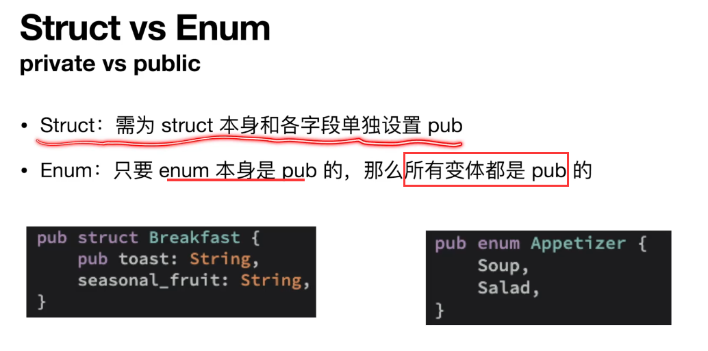

# 基本语法

## 函数调用方式（命名空间or引用）

```rust
//< 显示(解)引用使用 命名空间::
//< 隐式(解)引用使用 变量.
fn ref_core() {
    let x: Box<i32> = Box::new(1);
    let r: &Box<i32> = &x;
    let r_abs1 = i32::abs(**r); 
    let r_abs2 = r.abs();
    assert_eq!(r_abs1, r_abs2);

    let s = String::from("");
    let s_str1 = str::len(&s);
    let s_str2 = s.len();
    assert_eq!(s_str1, s_str2);
}
```


## 语句表达式

```rust
//< 表达式和语句
//< 语句可以返回值，且可以作为一个方法最后一个语句返回
//< let x = 1; 是表达式 | x+1 是语句
fn integer2() -> i32 { let x = 1; x + 1 }
```

## loop循环/标签

```rust
fn loop_core() {
    let mut count : i32 = 0;
    'breaking : loop {
        let mut flag : i32 = 3;
        loop {
            if flag == 1 {
                break;
            }
            if count == 1 {
                break 'breaking; // 语法糖，使用标签跳出外层循环
            }
            flag -= 1;
        }
        count += 1;
    }
    println!("count {count}");
}
```

## 切片

```rust
fn for_core() {
    let _arr = [10, 20 ,30];
     for val in _arr {
        println!("{val}");
    }
    //< 使用range 遍历集合的[0, 1]元素，=号是为了包含，可以不写或者写<，使用内置的rev（C++reverse）逆向遍历
    for val in (0..=1) .rev() {
        println!("{val}");
    }

}
```

# 斐波那契

```rust
fn fib(n : usize) -> usize {
    if n <= 2 { return n; }
    let mut prev1: usize = 1;
    let mut prev2: usize = 2;
    let mut current: usize = 0;
    let mut i: usize = 3;
    while i <= n {
        current = prev1 + prev2;
        prev1 = prev2;
        prev2 = current;
        i += 1;
    }
    return  prev2;
}
```


# 权限

变量的权限类型

**读R**：数据可以被复制到另一个位置

**写W**：数据可以被修改

**拥有O**：数据可以被移动或者释放

这些权限在运行时并不存在，尽在编译器内部存在

默认情况下，变量对数据具有R/O权限，如果加上关键字mut则还能够拥有W权限

**引用可以临时移除这些权限**

* 权限是定义在位置上的（不仅仅是变量）。
* 位置是任何可以放在赋值语句左侧的东西。
* 位置包括：
  * 变量，如 a
  * 位置的解引用，如*a
  * 位置的数组访问，如 a[0]
  * 位置的字段访问，如a.0（元组），a.x（结构体）
  * 上述的任何组合

```rust
let mut v: Vec<i32> = vec![1,2,3];	// v有R/W/O
let num: &i32 = &v[2];				// 执行完成这一行代码，v有R、num有R/O（权限O可以移动释放v[2]而不是v）、*num有R

//< 情况一，OK
println!("{*num}");					// 执行完成这一行代码，v有R/W/O、num和*num无任何权限
v.push(4);							// v无任何权限

//< 情况二，ERROR
v.push(4);							// v有R权限，错误他没有写权限但是尝试push
println!("{*num}");					
```

可变引用

```rust
let mut v: Vec<i32> = vec![1,2,3];	// v有R/W/O
let num: &mut i32 = &mut v[2];				// 执行完成这一行代码，v无任何权限、num有R/O、*num有R/W权限

我的理解，v[2]是数字，加上&，不能修改，再加上mut，可以通过指针修改，赋值一个可以修改值的指针给num，num有R/O权限操作这个指针，因为不是mut所以不能修改这个指针，O的权限是最终这个数据的最后一个对象持有

*num +=1;
let num2: & i32 = & *num; // 解引用获取 “可以修改值的指针”，在加上&使其降级为“只读指针”

println!("{*num}");	//执行完num、*num无任何权限，v有R/W/O
println!("{v}");	//执行完v无任何权限
```

流动权限F：在表达式使用输入引用或返回输出引用时需要

F权限在函数体内不会发生变化

如果一个引用被允许在特定的表达式中使用（流动），那么它就具有F权限

```rust
fn first_or(strings: &Vec<String>, default: &String) -> &String{
	if strings.len() > 0 { &strings[0] } else { default }//编译器报错，F权限仅在strings.len() 拥有，因为编译器不知道你返回的是哪一个引用
}

如果使用的时候你返回的是 &strings[0]，在外部使用的时候你却drop(default)，是非常危险的未定义行为

fn return_a_string() -> &String{
	let s = String::from("");
    let s_ref = &s;
    s_ref //s_ref没有F权限，本质上他是引用s，方法结束后s就被释放了，悬挂指针
}

解决方案一,所有权转移move
fn return_a_string() -> String{
	let s = String::from("");
    s
}
解决方案二，静态？
fn return_a_string() -> &'static str{
	""
}
解决方案三，Rc引用计数，shared_ptr
use std::rc::Rc;
fn return_a_string() -> RC<String>{
	let s = Rc::new(String::from(""));
    Rc::clone(&c)
}
解决方案四，参数引用
use std::rc::Rc;
fn return_a_string(output: &mut String){
    output.replace_range(.., "");//将字符串全部替换
}
```


```rust
//解决
let v: Vec<String> = vec![String::from("")];
let s: String = v[0].clone();
```


```rust
fn main() {
	let mut name = (String:;from("1"), String::from("2"));
	//let first = &name.0;  //ok，仅0失去mut权限
	let first = get_first(&name);//error, 本质一样，但是rust只看函数签名不了解内部情况，所以rust不知道参数的两个引用方法get_first返回的是&name.0还是&name.1，所以不知道是让哪一个元素赋值的first变量失去了mut权限
	name.1.push_str("");
	println!("{first}{name.1}");
}
fn get_first(name : &(String, String)) -> &String{
	&name.0
}
```


```rust
fn main() {
	let mut a = [0,1,2,3];
	let x = &mut a[1]; // x有R/W/O权限，a失去所有权限？还是有只读权限
	*x += 1;
	
	let y = &a[2]; // 错误,y不能获得O权限
	*x += *y;		//因为x还需要使用，O权限持有
	println!({a:?});
}
```


# 结构体

## Derived Trait

```rust
#[derive(Debug, Copy, Clone)]
struct Rect {
	width: u32,
    height: u32, // , 结尾
} //不需要加;

// 结构体的方法实现必须定义在外部，且加上impl，Rust摒弃了继承改用组合
impl Rect {
    // 方法的第一个参数必须是self，可不是&，类似C++的隐藏this指针
    fn area(&self) -> u32 {
        self.width * self.height
    }
    fn equal(&self, other: &Rect) -> bool {
        self.width == other.wdith && self.height == other.height
    }
    fn setWidth(&mut self, width: u32) {
        self.width = width;
    }
    /*
    如果使用这个max方法，那么外部的Rect对象所有权全部丢失
    */
    fn max(self, other: &Rect) -> Self {
    	let w = self.width.max(other);
        let h = self.height.max(other);
        Rect {
            width: w,
    		height: h
        }
    }
    
    fn setToMax(&mut self, other: &Rect) {
    	*self = self.max(other); // 错误，setToMax的self的所有权 被 max的self获取了, 解决，derive中加上Copy,Clone，max的传参self就相当于拷贝了数据
    }
    
    // 关联函数，可以没有第一个参数self，Self就是结构体的别名
    fn square(size: u32) -> Rect/*or Self*/ {
        Self {
            width: size,
    		height: size,
        }
    }
    
}

fn main() {
	let rect = Rect {
        height: 50,
        width: 30, //不需要考虑定义顺序
    };
    println!("{:?}", rect);	// 等价于println!("{rect:?}") 
    //方式一：为了打印Rect结构体，需要加 :? 并在Rect上加上#[derive(Debug)]，{}内部也可以写:#?，这样更清晰，类似Json的详细和缩略格式布局，
    //方式二：实现std::fmt::Dispaly
    let oehtrRect = Rect {
        height: 50,
        width: 50, //不需要考虑定义顺序
    };
    let maxRect = rect.max(oehtrRect);
    println!("{}", rect.area); // 错误rect 独享失去所有权限
}
```

# 枚举

```rust
fn main() {
    // 一般用法和C++一样
    
    // 特殊用法，枚举可以存值，值类型可以不同，类似std::pair
	enum IpAddrKind {
		V4(u8,u8,u8,u8),
		V6(String),
        VV
	}
    //枚举也可以实现方法
    impl IpAddrKind {
		fn XX(&self) {}
    }
    let home = IpAddrKind::V4(127,0,0,1);
    let loopback = IpAddrKind::V6(String::from("::1"));
}
// 特殊枚举，表示有/无，std::optional?，常用于判断对象是否为空，Rust没有null
enum Option<T> {
	None,
    Some<T>
}

fn main() {
	let x = 5;
    let y: Option<i8> = Some(5);
    let sum = x + y; // +错误，必须处理选项
    // 正确写法 
    // 一
    let sum = x + y.unwrap_or(0); // 当y为None时，默认用0替代
    // 二
    let sum = match y {
        Some(val) => x + val,
        None => x, // 或自定义处理逻辑，例如返回x本身
    };
    // 三
    let sum = if let Some(val) = y {
        x + val
    } else {
        x // 或其他默认值
    };
    println!("Sum = {}", sum); // 输出: Sum = 10
}
```

## Match（swich）/ if let

```rust
enum MonthDay {
	ThreeOne,
    Three,
}

enum Time {
	Year,
	Month(MonthDay),
	Day,
	Hour,
}

// 类似C#的swich语法糖,	match 的分支必须穷举情况
fn match_time(time: Time) -> u8{
	match time {
        Time::Year => 1,
        Time::Month(MonthDay) => 2,
        Time::Day => {
            println!("Have a good day");
            3
        },
        _ => 4,
	}
    if let Time::Year = time {
        println!("let time to Time::Year");
    };
}

let opt : Option<Stirng> = Some(String::from(""));

match opt {
    Some(_) => println!(""),
    None => println!(""),
}
println!("{:?}", opt); //ok ，因为match没有Some使用值

match /*&*/opt { 
    Some(s) => println!("{s}"),
    None => println!(""),
}
println!("{:?}", opt); //error ，opt部分值发生了移动，丧失了权限,	加引用修复


// if let 只匹配一种模式，也就是说除了指定需要的match 枚举，其他的是_，可以使用这个语法糖简化
fn match_time(time: &Time) {
	if let Time::Year = time {
        println!("let time to Time::Year");
    }
    /*else{}*/
    ;
}
```

# 模块

模块module，将代码组织成更小、更易于管理的单元方法，关键字mod

##  mod 定义的三种方式

1. 当前rs文件下定义

```rust
fn main() {}

mod models/*随便起一个模块名字，类似命名空间*/ {}
```

2. src/下新建rs文件定义

```rust
创建 src/模块文件，如math.rs

那么src 下的所有rs文件都能够使用
示例：
src
-math.rs
-main.rs 使用 mod math
/*使用类似python的包？*/
```

3.src/下新疆文件夹，文件夹

```rust
必须定义mod.rs文件进行识别，类似python的__init__文件？

src
-math.rs
-main.rs 使用 mod math，可以使用mod glm 模块
--glm
--mod.rs /*必须定义*/可以使用mod math 模块
```

## 顶级模块crate

只要你定义了模块，可以使用crate进行指定

```rust
crate::glm接glm子模块接方法
crate::math接math子模块接方法
示例
math.rs文件
    pub mod cal{
        pub fn rect_area(w :&u32, h: &u32) -> u32 {
            w * h
        }

    }
main.rs文件
mod math; //引入
fn main() {
    let w:u32 = 10;
    let h:u32 = 10;
    let result = crate::math::cal::rect_area(&w, &h);
}

或者在main.rs文件中定义
mod math {
    pub mod cal{
        pub fn rect_area(w :&u32, h: &u32) -> u32 {
            w * h
        }

    }
}


或者这样写
src
-glm
--mod.rs
--math.rs
-main.rs
//math.rs文件
	fn test() {
		self::constval::get_pi();
	}
    pub mod cal{
        pub fn rect_area(w :&u32, h: &u32) -> u32 {
            w * h
        }
		pub fn circle_area(r :& f64) ->f64 {
			r * r * super::constval::get_pi() // 回退上级模块
		}
    }
    pub mod constval{
    	pub fn get_pi() -> f64 {
    		3.1415926
    	}
    }

//mod.rs文件
pub mod math;

//main.rs文件
mod glm;
fn main() {
    fib(10);
    let w:u32 = 10;
    let h:u32 = 10;
    let result = crate::glm::math::cal::rect_area(&w, &h);
    //() //main 方法隐含了一个语句
}

简化写法
mod glm;
use crate::glm::math::cal;// 类似c++/C#的命名空间导入using
fn main() {
    fib(10);
    let w:u32 = 10;
    let h:u32 = 10;
    let result = cal::rect_area(&w, &h);
    //() //main 方法隐含了一个语句
}
```

可以使用super::回退当前模块得到上级模块，或者使用self::当前模块下查找其他模块

```
mod math {
	fn test() {
		self::constval::get_pi();
	}
    pub mod cal{
        pub fn rect_area(w :&u32, h: &u32) -> u32 {
            w * h
        }
		pub fn circle_area(r :& f64) ->f64 {
			r * r * super::constval::get_pi() // 回退上级模块
		}
    }
    pub mod constval{
    	pub fn get_pi() -> f64 {
    		3.1415926
    	}
    }
}
```

## 可见性




## use


as关键字起别名

```rust
use std::fmt::Result
use std::io::Result as IoResult
```


多个模块的库可以使用类似vue模块导入写法

```rust
use csv::{Writer, ReaderBUlider};//指定使用部分模块
use csv::*;//使用全部模块
```


## 三方库使用

（1）在toml文件的dependencies 中手动添加

```toml
[package]
name = "rustlearn"
version = "0.1.0"
edition = "2024"

[dependencies]
csv = "1.3.0"
```

（2）cmd命令行添加

```
cargo add serde （一个序列号反序列化的库）完成之后会在toml自动写入库名字和版本
```

# Vec

```rust
//获取值
fn main() {
    let v = vec![1,2,3];
	let third: &i32 = &v[2];
	
	let third: Option<&i32> = v.get(2);
	if let None = third { println!("out of range") }
}


```

```rust
//遍历
fn main() {    
    let mut v = Vec::new();
    let s = String::from("s");
    v.push(s);
    for index in (0..v.len()) {
        v.get(index);
    }
    for val in /*&mut*/v {
        let x = val;
    }
    for val: &String in v.iter()/*等价&v*/ {
        let x: &String = val;
    }
    for val: &String in v.iter() {
        let x: String = (*val).clone(); // 简写val.clone()
    }
    //() //main 方法隐含了一个语句
}
```

# String

内部逻辑是Vec<u8>实现的包装

```rust
fn main () {
    let mut s = String::new();
    let data: &str data = "xx";
    let s: String = data.to_string(); // 实现了Trait（接口）的结构体能够使用这个方法将&str转换为String
    let s = String::from("");
    
    let s1 = String::from("");
    let s2 = String::from("");
    let s3 = s1 + &s2; //执行完之后 s1 被移动 不能再使用，而s2是引用可以使用
    // 内部逻辑是获得s1的所有权，让后将s2拷贝一份加到s1的后边，如果s1的cap足够大，那么s1不会内存分配，否则内存分配（c++的vector动态扩容机制），然后将s1的所有权移动给s3
    
    let s = format!("{s1}-{s2}-{s3}");//较于 + 拼接，这种方式更常用
}
```

## 遍历

```rust
//< 和C++不同，索引访问不被允许，原因是应为u8编码占字节不同原因
let s = "我们的";
let i = &s[0]; // 错误

//< 切片遍历
let s1 = &s[0..9]; //  ok，输出“我们的“，中文一个字占3个字节
let s2 = &s[0..2]; // 错误，不能将其拆分
let s2 = &s[0..=2]; // ok，输出我“

//< 标准库提供遍历

for c in s.chars() {
    println!("{c}"); // 字符
}

for b in s.bytes() {
    println!("{b}"); // 十进制编码 230 136 145 代表我
}
```


# HashMap

默认使用SipHash进行hash操作，相对安全，但是比较C++的来说不够快，可以通过指定的hasher（实现BulidHasher这个Trait）来切换自定义的hash函数

```rust
use std::collections::HashMap;
fn main() {    
    use std::collections::HashMap;

    let mut dict = HashMap::new();
	dict.insert(String::from("A"), 10);
	dict.insert(String::from("A"), 20); //覆盖10
    let val: &mut i32 = dict.entry(String::from("A")).or_insert(30);//如果不存在插入30，存在则返回存在的值的引用
    println!("{dict:?}");
    
    let text:&str = "hello world A world";
    for word in text.split_whitespace() {
        let count = map.entry(word).or_insert(0);
        *count += 1;
    }
}
```

# 处理错误的机制

rust没有exception

## panic!()


panic!后的响应模式

1. 展开Stack并清理数据（默认）

2. 立即终止(abort)

   * 使用abort

   ```toml
   Cargo.toml
   
   [package]
   
   [dependencies]
   #添加以下代码
   [profile.release]
   panic = "abort"
   ```


栈追踪 backtrace （必须在Debug模式）

使用

项目目录下

```
cargo run
SET RUST_BACKTRACE = 1 /*更详细的话写full*/
cargo run
```

## enum Result<T,E>

```
enum Result<T,E> {
	Ok(T), // 成功返回句柄
	Err(E), // 包含错误信息
}

use std::fs::File;
fn main() {
	let file = File::open("test.txt");
	println!("{file:?}"); 
	// 如果不存在，输出Err(0s {code: 2, kind: NotFound, message: "The system cannot find the file specified."})
    // 如果存在，输出Ok(File {handle: 0xac, path: "\\\?\\test.txt的绝对路径")
    
     //具体操作
    let file = match File::open("test.txt") {
    	Ok(file) => file,
    	Err(error) => panic!("open failed {error:?}")
    };
    // 更详细的错误处理
    let file = match File::open("test.txt") {
    	Ok(file) => file,
    	Err(error) => match error.kind() {
    		ErrorKind::NotFound => match File::create("test.txt") {
    			Ok(fc) => fc,
    			Err(e) => panic!("create failed {e:?}")
    		},
    		other_err => panic!("unknown failed {other_err:?}")
    	}
    };
}
```

## panic和Result使用情况


## unwrap/expect


## 错误传递


## ? operator简化match/ if let


```rust
fn last_char_of_first_line(text: &str) -> Option<char> {
	text.lines().next()?.chars().last() //next错误直接返回，否则继续执行链式调用
}

fn main() /*-> Result<(), Box<dyn Error>>*/ {
	let file = File::open("test.txt")?; //错误，main的返回类型是 (), 去掉注释就正确
	
	/*Ok(())*/
}
```

如果操作成功，它会解包Ok并继续执行下一行代码

如果操作失败，它会立即返回Err，并将错误传播给调用者

以下三种代码写法等价


## 自定义错误处理


```rust
use std::io::{Error, Read};
use std::io;
use std::fs::File;
use std::num::PaserIntError;

#[derive(Debug)]
pub enum MyError {
	IO(io::Error)
    PARSEINT(PaserIntError)
    OTHER(String)
}

impl From<io::Error> for MyError {
    fn from(value: Error) -> Self {
        MyError::IO(value)
    }
}

impl From<PaserIntError> for MyError {
    fn from(value: PaserIntError) -> Self {
        MyError::PARSEINT(value)
    }
}


fn read_username_from_file() -> Result<String, MyError> {
    let mut name = String::new();
    let file = File::open("text.txt")?.read_to_string(&mut name)?;
	let num: i32 = "55".parse()?;
    Ok(name)
}
```

# 泛型

```rust
// 需要假设T类型是能够通过 > 进行比较的类型
fn largest<T>(list: &[T]) ->&T {
    let mut largest = &list[0];
    for item in list {
        if item > largest { largest = item }; // 这里会报错，之后需要进行约束
    }
    largest
}

// 模板类
struct Point<T> {
    x: T,
    y: T
}

impl<T> Point<T> {
    fn x(&self) -> &T {
        self.x
    }
}

//特化
impl Point<f32> {
    fn distance_from_origin(&self) -> f32 {
        (self.x.powi(2) + self.y.powi(2)).sqrt()
    }
}
```

# Trait

## 使用示例

一个Trait定义了特定类型的所有功能

可以使用Trait以一种抽象的方式来定义共享的行为

可以使用Trait Bounds 来指定哪些类型才是我们想要的泛型类型

```rust
// 类似java接口, RUST没有继承，所以没有C++虚函数作为接口概念
pub trait Summary {
	fn summarize(&self) -> String; // 可以有默认实现写法
    /*
    fn summarize(&self) -> String {
        String::from("Default")
    }
    */
}

pub struct NewsArticle {
	pub headline: String,
	pub location: String,
	pub author: String,
	pub content: String,
}

pub struct Tweet {
	pub username: String,
	pub content: String,
	pub reply: bool,
	pub retweet: bool,
}

impl Summary for NewsArticle {
    fn summarize(&self) -> String {
        format!("{}, by {} ({})", self.headline, self,author, self,location)
    }
}

impl Summary for Tweet {
    fn summarize(&self) -> String {
        format!("{}: {} ({})", self.username, self,content)
    }
}

/*
// 传入trait作为参数，类似java的通过接口组合模式，来实现不同的具体类型的同一行为（Animal 叫， dog 叫， 猫叫）
pub fn notify(item: &impl Summary) {
	println!("")
}
*/
```

## Trait的实现规则


## trait bound 约束

类似C++20 的concept，trait bound需要指定在方法后面<>进行括起来，或者参数使用impl约束

```rust
// 写法一
pub fn notify<T: Summary>(item: &T) { // 约束T类型必须是实现了Summary
	
}
// 写法二
pub fn notify(item1: &impl Summary, item2: &impl Summary) {
    
}

// 多个trait bound 的指定
// 写法一
pub fn notify<T: Summary + Display>(item: &T) { // 约束T类型必须是实现了Summary
	
}
// 写法二
pub fn notify(item: &(impl Summary + Display)) {
    
}

where 简化签名
fn some_func<T, U>(t: &T, u: &U) -> i32 
	where
		T:Summary + Display,
		U:Clone + Debug,
{
    
}
```

# 生命周期

目的是防止悬挂指针，Rust值悬垂引用，和C++一样出了花括号就被释放，RAII思想


## 生命周期注解

生命周期注解**不会改变引用存活的时间**

而是**描述多个引用之间的生命周期关系**


语法：

生命周期参数：

必须以 ' 开头，通常是小写，并且非常短，位置紧跟在引用&后，用空格和类型分开

```rust
&i32
&'a i32
&'a mut i32
```

函数生命周期注释

```rust
// 如果不写生命周期注解，那么以下方法会报错，因为编译器不知道返回的是x引用还是y引用
// 'a 代表 x 和 y 中 生命周期 较短 的那一个
fn longest<'a>(x: &'a str, y: &'a str2) -> &'a str {
	if x.len() > y.len() {x} else {y}
}

fn main() {
    // ok
    let string1 = String::from(" string1 longest");
    {
        let string2 = String::from("string2");
        let result = longest(string1.as_str(), string2.as_str());
        println("Longest is {result}");
    }
    
    // error, result生命周期取决于 string1 和 string2 中最短的那一个，这里string2最短，只能够在string2的生命周期内使用result，如果超出就报错
    let string1 = String::from(" string1 longest");
    let result;
    {
        let string2 = String::from("string2");
        result = longest(string1.as_str(), string2.as_str());
    }
    println("Longest is {result}");
}
```

结构体生命周期注解

如果结构体成员变量定义了生命周期注解，那么这个结构体对象的生命周期将取决与最短的那一个变量生命周期

```rust
struct ImportantExcerpt<'a>{
	part: &'a str,
}

fn main() {
	let novel = String::from("call me x. some.");
	let first_sentence = novel.split('.').next().unwrap();
	let i = ImportantExcerpt{
		part: first_sentence,
	}; //i的生命周期取决于 ，part的生命周期
}
```

## 三条规则


```rust
三条规则使用
//<规则一
// 编译器自动推断 ok
fn first_word(s: &str) -> &str
//< 规则二 ok
fn first_word<'a>(s: &'a str) -> &str
fn first_word<'a>(s: &'a str) -> &'a str

// error 推断不出
fn first_word(x: &str, y: &str) -> &str
fn first_word<'a, 'b>(x: &'a str, y: &'b str) -> &/*?*/ str

//< 规则三
impl<'a> ImportantExcerpt<'a> {
    fn announce_and_return_part(&self. anno: &str) -> &str { // 返回的&str生命正确是&self的生命周期，即ImportantExcerpt对象的生命周期
        println!("{anno}");
        self.part
	}
}
```


```rust
struct Foo<'a> {
    bar: &'a i32
}
fn baz(f:&Foo) ->&i32 { //错误，Foo的生命周期取决于bar，而参数却传入&
    f.bar
}
fn baz(f:Foo) ->&i32 { //ok
    f.bar
}
```


## 静态生命周期

生命周期跟随程序

写法 'static

注意：Rust中**所有字符串字面量**，都具有'static 生命周期

```rust
let s: &'static str = "II";
```

## 综合

```rust
use std::fmt::Display;

fn longest_with_an_announcement<'a, T>(
	x: &'a str,
	y: &'a str,
	anno: T, // 可以有,
) -> &'a str
where
	T: Display, // 可以有,
{
	println!("{anno}");
	if x.len() > y.len() {x} else {y}
}
```

# 编写测试

类似java注解测试，控制台输出类似c++/gtest

注解

模块的#[cfg(test)]

方法的 #[test]

执行

**cargo test**

```rust
pub fn add(left:u64, right:u64) -> u64 {left+right}

pub struct Guess {
    value: i32,
}

impl Fyess {
    pub fn new(value: i32) -> Guess {
        if value < 1 {
			panic!("Guess value must be greater or equal to 1, got {value}.");
        }
        else if value > 100 {
			panic!("Guess value must be less than or equal to 100, got {value}.");
        }
        Guess{value}
    }
}
#[cfg(test)]
mod test{
	use super::*;
	#[test]
	fn it_works() {
		let result = add(2,2);
		assert_eq!(result, 4);
	}
    
    #[test] // 处理Err可以这样写，但是返回了Result就不能使用#[should_panic]
	fn it_works() -> Result<(), String> {
		let result = add(2,2);
		if result == 4 { Ok(()) } else { Err(String::from("add value not equal 4")) }
	}
    
    #[test]
    #[should_panic] // 边界测试，发生panic就是true通过，负责测试是failed
    //#[should_panic(expected = "less than or equal to 100")] // 只有大于100捕获输出，测试返回success，否则failed
    fn greater_than_100(){
        Guess::new(200); 
    }
}
```

# 执行与组织测试

测试的默认运行模式是**并行模式**

所以必须确保：

1. 各个测试不互相依赖

2. 不依赖于共享的状态（包括环境：目录、环境变量等

单线程测试 `cargo test -- --test-threads=1`


测试默认是看不到代码中print的内容

要想显示 `cargo test -- --show-output`


指定跑某个测试方法

`cargo test 测试方法的名字（比如 add）`

指定跑某些具有部分相同名字的测试方法

`cargo test 测试方法的名字（比如 add_point, add_rect 那么我们输入add即可）`


使用#[ignore]可以不跑所有被忽略的测试

```
#[test]
#[ignore]
fn add() {}
```

进行跑所有被忽略的测试

`cargo test -- --ignored`

跑所有的测试

`cargo test -- --include-ignored`


跑集成测试

`cargo test --集成测试的文件名称`


如果有辅助的文件给集成测试文件使用，一、将common.rs和集成测试的rs文件同级，但是这样cargo测试之后会输出common的测试这样不够清晰，二、为此我们可以新建一个common文件夹再建一个mod.rs文件内防止测试辅助函数，这样测试就不会输出这个辅助函数的测试模块


# 闭包

可以存储在变量中或作为参数传递给其他的匿名函数（lambda）
